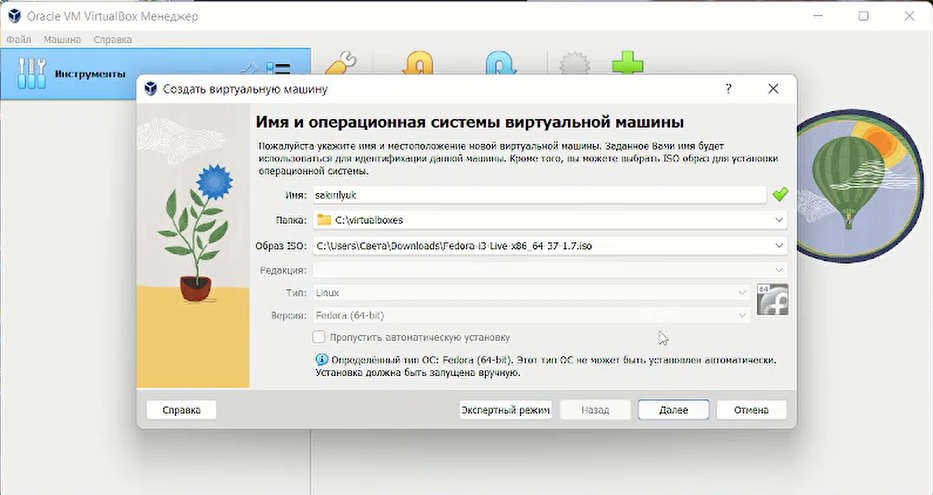
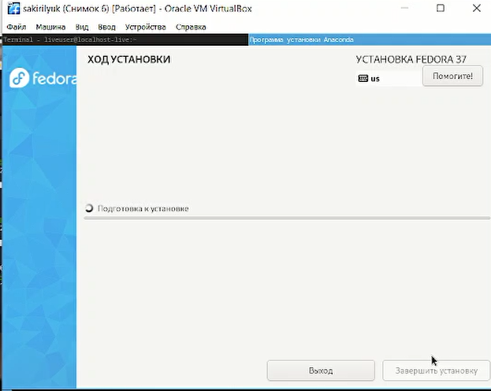
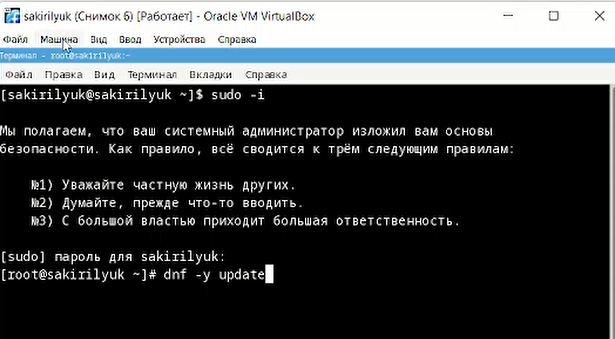
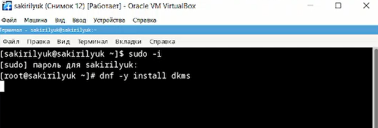

---
## Front matter
lang: ru-RU
title: Лабораторная работа №1
subtitle: Операционные системы
author:
  - Кирилюк А. С.
institute:
  - Российский университет дружбы народов, Москва, Россия
  - физико-математический факультет
date: 18 февраля 2023

## i18n babel
babel-lang: russian
babel-otherlangs: english

## Formatting pdf
toc: false
toc-title: Содержание
slide_level: 2
aspectratio: 169
section-titles: true
theme: metropolis
header-includes:
 - \metroset{progressbar=frametitle,sectionpage=progressbar,numbering=fraction}
 - '\makeatletter'
 - '\beamer@ignorenonframefalse'
 - '\makeatother'
---

# Информация

## Докладчик

:::::::::::::: {.columns align=center}
::: {.column width="70%"}

  * Кирилюк Светлана Алексеевна
  * физико-математический факультет
  * направление математика и механика, 1 курс, бакалавриат
  * Российский университет дружбы народов

:::
::: {.column width="30%"}

:::
::::::::::::::

# Вводная часть

## Цели и задачи

- Целью данной работы является приобретение практических навыков установки операционной системы на виртуальную машину, настройки минимально необходимых для дальнейшей работы сервисов.

# Ход работы

## Установка виртуальной машины

В первую очередь скачиваем VirtualBox, настраеваем будущую виртуальную машину (размер жёсткого диска, процессор, название машины и т.д) и создаем её

:::
::::::::::::::

## Установка операционной системы

На этом этапе настраиваем язык и часовой пояс, выбираем место установки, задаём имя узла, создаём пользователя и включаем учетную запись.

:::
::::::::::::::

## После установки

После установки ОС проводим обновление всех пакетов, настраиваем автообновление и устанавливаем программы для повышения комфорта работы. Отключаем SELinux и настраеваем раскладку клавиатуры.

:::
::::::::::::::

## Обновление драйверов

Переключившись на роль супер-пользователя, вводим команду для установки драйверов.

:::
::::::::::::::

## Установка texlive и pandoc

Для создания отчётов в дальнейшем устанавливаем pandoc и texlive

:::
::::::::::::::

## Вывод

В ходе лабораторной работы я приобрела практические навыки установки операционной системы на виртуальную машину, настройки минимально необходимых для дальнейшей работы сервисов.

