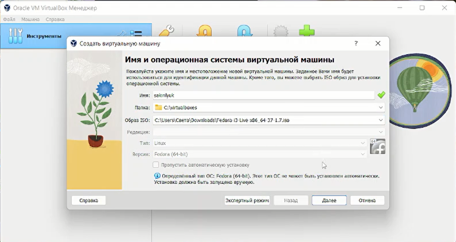
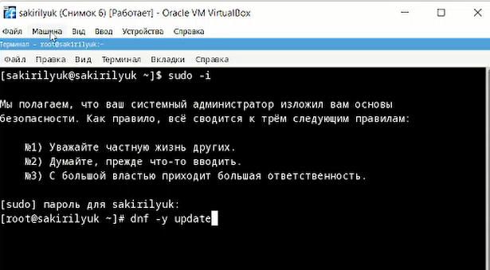
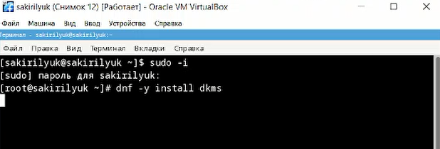
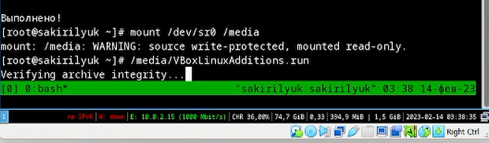
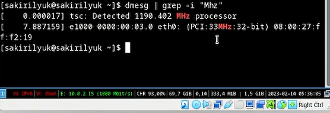

---
## Front matter
title: "Лабораторная работа №1"
subtitle: "Операционные системы"
author: "Кирилюк Светлана Алексеевна"

## Generic otions
lang: ru-RU
toc-title: "Содержание"

## Bibliography
bibliography: bib/cite.bib
csl: pandoc/csl/gost-r-7-0-5-2008-numeric.csl

## Pdf output format
toc: true # Table of contents
toc-depth: 2
lof: true # List of figures
lot: true # List of tables
fontsize: 12pt
linestretch: 1.5
papersize: a4
documentclass: scrreprt
## I18n polyglossia
polyglossia-lang:
  name: russian
  options:
	- spelling=modern
	- babelshorthands=true
polyglossia-otherlangs:
  name: english
## I18n babel
babel-lang: russian
babel-otherlangs: english
## Fonts
mainfont: PT Serif
romanfont: PT Serif
sansfont: PT Sans
monofont: PT Mono
mainfontoptions: Ligatures=TeX
romanfontoptions: Ligatures=TeX
sansfontoptions: Ligatures=TeX,Scale=MatchLowercase
monofontoptions: Scale=MatchLowercase,Scale=0.9
## Biblatex
biblatex: true
biblio-style: "gost-numeric"
biblatexoptions:
  - parentracker=true
  - backend=biber
  - hyperref=auto
  - language=auto
  - autolang=other*
  - citestyle=gost-numeric
## Pandoc-crossref LaTeX customization
figureTitle: "Рис."
tableTitle: "Таблица"
listingTitle: "Листинг"
lofTitle: "Список иллюстраций"
lotTitle: "Список таблиц"
lolTitle: "Листинги"
## Misc options
indent: true
header-includes:
  - \usepackage{indentfirst}
  - \usepackage{float} # keep figures where there are in the text
  - \floatplacement{figure}{H} # keep figures where there are in the text
---

# Цель работы

Приобретение практических навыков установки операционной системы на виртуальную машину, настройки минимально необходимых сервисов для дальнейшей работы.

# Выполнение лабораторной работы

Перед началом работы я скачала образ операционной системы и установила VirtualBox на свой компьютер. Запустив VirtualBox я выбрала папку для хранения будущей машины (рис. @fig:fig1) и настроила хост-клавиши (рис. @fig:fig2).

{#fig:fig1 width=90%}

{#fig:fig2 width=90%}

Затем я создала виртуальную машину, указала её название и образ (рис. @fig:fig3), отрегулировала объём основной памяти (рис. @fig:fig4) и создала новый виртуальный жёсткий диск (рис. @fig:fig5).

{#fig:fig3 width=90%}

{#fig:fig4 width=90%}

{#fig:fig5 width=90%}

Открыв созданную машину, я перешла в терминал и ввела команду для открытия окна с настройкой интерфейса (рис. @fig:fig6). Здесь я настроила язык и часовой пояс, выбрала место установки (рис. @fig:fig7), задала имя узла (рис. @fig:fig8), создала учётную запись (рис. @fig:fig9) и создала пользователя (рис. @fig:fig10).

{#fig:fig6 width=90%}

{#fig:fig7 width=90%}

{#fig:fig8 width=90%}

{#fig:fig9 width=90%}

{#fig:fig10 width=90%}

После настройки виртуальной машины я начала установку (рис. @fig:fig11). После её оканчания, я закрыла виртуальную машину и изъяла диск (рис. @fig:fig12).

{#fig:fig11 width=90%}

{#fig:fig12 width=90%}

Я снова запустила машину и приступила к обновлению всех пакетов (рис. @fig:fig13). Затем я установила программы для удобста работы консоли (рис. @fig:fig14) и програмное обеспечение (рис. @fig:fig15), после чего командой запустила таймер (рис. @fig:fig16).

{#fig:fig13 width=90%}

{#fig:fig14 width=90%}

{#fig:fig15 width=90%}

{#fig:fig16 width=90%}

Далее я перешела к отключению SELinux, заменив значение SELINUX=enforcing на SELINUX=permissive в файле /etc/selinux/config (рис. @fig:fig17).

{#fig:fig17 width=90%}

Переключившись на роль супер-пользователя, я установила драйвера  (рис. @fig:fig18), (рис. @fig:fig19).

{#fig:fig18 width=90%}

{#fig:fig19 width=90%}

Затем я настроила раскладку клавиатуры, отредактировав конфигурационный файл (рис. @fig:fig20).

{#fig:fig20 width=90%}

Также я установила pandoc (рис. @fig:fig21) и texlive (рис. @fig:fig22).

{#fig:fig21 width=90%}

{#fig:fig22 width=90%}

Затем я приступила к выполнению домашней работы. Введя необходимые команды я узнала информацию про последовательность монтирования файловых систем (рис. @fig:fig23), (рис. @fig:fig24), версию ядра (рис. @fig:fig25), частоту процессора (рис. @fig:fig26), его модель (рис. @fig:fig27), объём доступной памяти (рис. @fig:fig28), тип обнаружения гипервизора (рис. @fig:fig29) и тип файловой системы корневого каталога (рис. @fig:fig30).

{#fig:fig23 width=90%}

{#fig:fig24 width=90%}

{#fig:fig25 width=90%}

{#fig:fig26 width=90%}

{#fig:fig27 width=90%}

{#fig:fig28 width=90%}

{#fig:fig29 width=90%}

{#fig:fig30 width=90%}

Ответы на вопросы:

1)Учетная запись содержит сведения, необходимые для идентификации пользователя.

2)
2.1 cat /etc/*-release (~$ cat /etc/*-release PRETTY_NAME="Debian GNU/Linux 10)
2.2 cd (cd ~/work/study/2022-2023/"Операционные системы")
2.3 sudo (sudo du -sh /home/root-user/Downloads)
2.4 mkdir - создание каталогов и файлов (mkdir -p ~/work/study/2022-2023/"Операционные системы"). rm - удаление каталогов и файлов (rm -r dir1)
2.5 sudo -i
2.6 history ( history -c)

3)Файловая система - прядок, определяющий способ организации, хранения и именования данных на носителях информации в компьютерах и других электронных оборудованиях.

4)Выполнить команду dmesg/

5)При помощи команд ps и grep определяем идентификатор процесса PID и удаляем его командами kill или killall

# Выводы

В ходе работы я приобрела практические навыки установки операционной системы на виртуальную машину, настройки минимально необходимых сервисов для дальнейшей работы.

