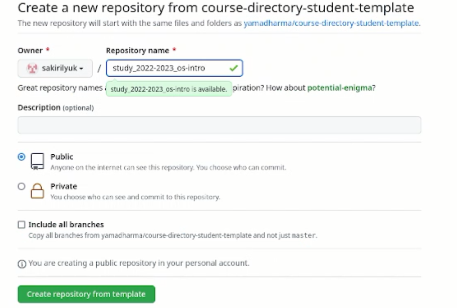

---
## Front matter
lang: ru-RU
title: Лабораторная работа №2
subtitle: Операционные системы
author:
  - Кирилюк С. А.
institute:
  - Российский университет дружбы народов, Москва, Россия
  - Факультет физико-математических наук
date: 18 февраля 2023

## i18n babel
babel-lang: russian
babel-otherlangs: english

## Formatting pdf
toc: false
toc-title: Содержание
slide_level: 2
aspectratio: 169
section-titles: true
theme: metropolis
header-includes:
 - \metroset{progressbar=frametitle,sectionpage=progressbar,numbering=fraction}
 - '\makeatletter'
 - '\beamer@ignorenonframefalse'
 - '\makeatother'
---

# Информация

## Докладчик

:::::::::::::: {.columns align=center}
::: {.column width="70%"}

  * Кирилюк Светлана Алексеевна
  * студент физико-математического факультета
  * направление математика и механика
  * Российский университет дружбы народов
 

:::
::: {.column width="30%"}

:::
::::::::::::::

# Вводная часть

## Цели и задачи

- Изучить идеологию и применение средств контроля версий
- Освоить умения по работе с git.

# Ход работы

## Установка программ

Перед началом работы необходимо установить git и gh. Далее нужно задать базовую настройку git и gh.

:::
::::::::::::::

## Создание pgp ключа

В терминале генерируем ключ, затем при помощи команды выводим список ключей и копируем отпечаток приватного ключа. Копируем сгенерированный PGP ключ в буфер обмена и загружаем на GitHub.

:::
::::::::::::::

## Создание ssh ключей

По алгоритму rsa создаём ключ размером 4096 бит, по алгоритму ed25519 создаём второй ключ.

:::
::::::::::::::

## Создание репозитория

В первую очередь создаём шаблон рабочего пространства, затем настраиваем каталог курса, удаляя лишние файлы и создавая необходимые каталоги. Отправляем файлы на сервер.

:::
::::::::::::::

## Вывод

В ходе работы я изучилв идеологию и применение средств контроля версий и освоила умения по работе с git.

