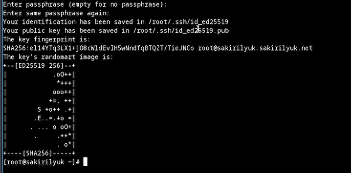

---
## Front matter
title: "Лабораторная работа №2"
subtitle: "Операционные системы"
author: "Кирилюк Светлана"
## Generic otions
lang: ru-RU
toc-title: "Содержание"

## Bibliography
bibliography: bib/cite.bib
csl: pandoc/csl/gost-r-7-0-5-2008-numeric.csl

## Pdf output format
toc: true # Table of contents
toc-depth: 2
lof: true # List of figures
lot: true # List of tables
fontsize: 12pt
linestretch: 1.5
papersize: a4
documentclass: scrreprt
## I18n polyglossia
polyglossia-lang:
  name: russian
  options:
	- spelling=modern
	- babelshorthands=true
polyglossia-otherlangs:
  name: english
## I18n babel
babel-lang: russian
babel-otherlangs: english
## Fonts
mainfont: PT Serif
romanfont: PT Serif
sansfont: PT Sans
monofont: PT Mono
mainfontoptions: Ligatures=TeX
romanfontoptions: Ligatures=TeX
sansfontoptions: Ligatures=TeX,Scale=MatchLowercase
monofontoptions: Scale=MatchLowercase,Scale=0.9
## Biblatex
biblatex: true
biblio-style: "gost-numeric"
biblatexoptions:
  - parentracker=true
  - backend=biber
  - hyperref=auto
  - language=auto
  - autolang=other*
  - citestyle=gost-numeric
## Pandoc-crossref LaTeX customization
figureTitle: "Рис."
tableTitle: "Таблица"
listingTitle: "Листинг"
lofTitle: "Список иллюстраций"
lotTitle: "Список таблиц"
lolTitle: "Листинги"
## Misc options
indent: true
header-includes:
  - \usepackage{indentfirst}
  - \usepackage{float} # keep figures where there are in the text
  - \floatplacement{figure}{H} # keep figures where there are in the text
---

# Цель работы

Изучить идеологию и применение средств контроля версий. Освоить умения по работе с git.

# Задание
1)Создать базовую конфигурацию для работы с git.
2)Создать ключ SSH.
3)Создать ключ PGP.
4)Настроить подписи git.
5)Зарегистрироваться на Github.
6)Создать локальный каталог для выполнения заданий по предмету.

# Выполнение лабораторной работы

В первую очередь я установила git (рис. @fig:fig1) и gh (рис. @fig:fig2).

{#fig:fig1 width=90%}

{#fig:fig2 width=90%}

Затем я задала имя и email владельца репозитория (рис. @fig:fig3) и настроила utf-8 в выводе сообщений git
(рис. @fig:fig4).

{#fig:fig3 width=90%}

{#fig:fig4 width=90%}

Я сгенерировала pgp ключ (рис. @fig:fig5), вывела список ключей и скопировала отпечаток приватного ключа (рис. @fig:fig6), чтобы скопировать сгенерированный PGP ключ в буфер обмена (рис. @fig:fig7). Затем я вставила полученный ключ в строку на GitHub (рис. @fig:fig8).

{#fig:fig5 width=90%}

{#fig:fig6 width=90%}

{#fig:fig7 width=90%}

{#fig:fig8 width=90%}

Также я настроила автоматические подписи коммитов (рис. @fig:fig9), задала параметры autocrlf и safecrlf и сгенерировала ключи по двум алгоритмам (рис. @fig:fig10), (рис. @fig:fig11).

{#fig:fig9 width=90%}

{#fig:fig10 width=90%}

{#fig:fig11 width=90%}

Далее я авторизовалась (рис. @fig:fig12), (рис. @fig:fig13). Создала шаблон репозитория (рис. @fig:fig14), (рис. @fig:fig15).

{#fig:fig12 width=90%}

{#fig:fig13 width=90%}

{#fig:fig14 width=90%}

{#fig:fig15 width=90%}

Перейдя в каталог курса я удалила лишние файлы и создала необходимые каталоги (рис. @fig:fig16), затем отправила файлы на сервер (рис. @fig:fig17).

{#fig:fig16 width=90%}

{#fig:fig17 width=90%}

Ответы на контрольные вопросы:
1)Система контроля версий (VCS) — это место хранения кода. Она нужна для разработки продуктов (для хранение кода, синхронизации работы нескольких человек, создания релизов).

2)
2.1 Хранилище (репозиторий) - центральное место, хранящее не только файлы, но и историю. Доступ к репозиторию осуществляется через сеть, выступая в роли сервера и инструмента контроля версий, выступающего в роли клиента.
2.2 Commit - это команда Git для записи индексированных изменений в репозиторий. 
2.3 Рабочая копия – это снимок хранилища, личное рабочее место, где разработчики могут выполнять свою работу, оставаясь изолированными от остальной части команды.

3)
3.1 Централизованные VCS
Одно основное хранилище всего проекта;
Каждый пользователь копирует себе необходимые ему файлы из этого репозитория, изменяет и, затем, добавляет свои изменения обратно.
3.2 Децентрализованные VCS
У каждого пользователя свой вариант (возможно не один) репозитория;
Присутствует возможность добавлять и забирать изменения из любого репозитория.

6)Git — это система управления версиями. У Git две основных задачи: первая — хранить информацию о всех изменениях в вашем коде, начиная с самой первой строчки, а вторая — обеспечение удобства командной работы над кодом.

7)
7.1 Создание основного дерева репозитория: git init
7.2 Получение обновлений (изменений) текущего дерева из центрального репозитория: git pull
7.3 Отправка всех произведённых изменений локального дерева в центральный репозиторий: git push
7.4 Просмотр списка изменённых файлов в текущей директории: git status
7.5 Просмотр текущих изменений: git diff
7.6 Сохранение текущих изменений: добавить все изменённые и/или созданные файлы и/или каталоги (git add), добавить конкретные изменённые и/или созданные файлы и/или каталоги (git add имена_файлов), удалить файл и/или каталог из индекса репозитория (при этом файл и/или каталог остаётся в локальной директории) (git rm имена_файлов).
7.7 Сохранение добавленных изменений: сохранить все добавленные изменения и все изменённые файлы (git commit -am 'Описание коммита'), сохранить добавленные изменения с внесением комментария через встроенный редактор (git commit), создание новой ветки, базирующейся на текущей (git checkout -b имя_ветки), переключение на некоторую ветку (git checkout имя_ветки), отправка изменений конкретной ветки в центральный репозиторий (git push origin имя_ветки), слияние ветки с текущим деревом (git merge --no-ff имя_ветки)
7.8 Удаление ветки: удаление локальной уже слитой с основным деревом ветки (git branch -d имя_ветки), принудительное удаление локальной ветки (git branch -D имя_ветки), удаление ветки с центрального репозитория (git push origin :имя_ветки).

9) Ветка (англ. branch) — это последовательность коммитов, в которой ведётся параллельная разработка какого-либо функционала Основная ветка– master Ветки в GIT. Ветки нужны, чтобы несколько программистов могли вести работу над одним и тем же проектом или даже файлом одновременно, при этом не мешая друг другу. Кроме того, ветки используются для тестирования экспериментальных функций.

10)Игнорируемые файлы — это, как правило, артефакты сборки и файлы, генерируемые машиной из исходных файлов в репозитории, либо файлы, которые по какой-либо иной причине не должны попадать в коммиты

# Выводы

В ходе работы я изучила идеологию и применение средств контроля версий. Освоила умения по работе с git.
