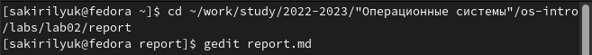
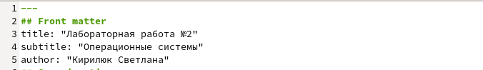
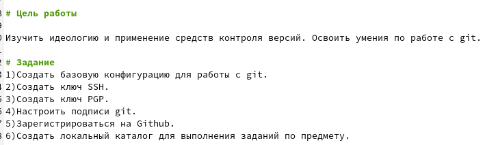
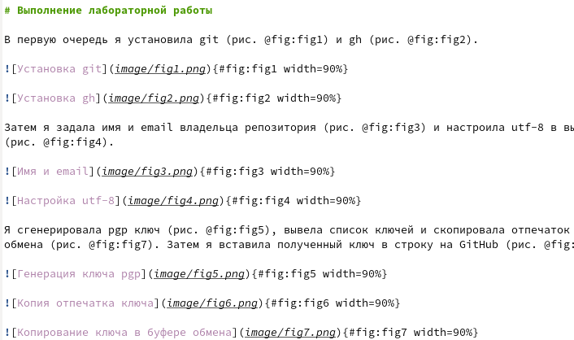
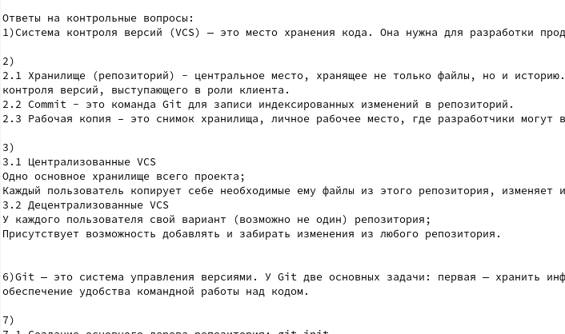
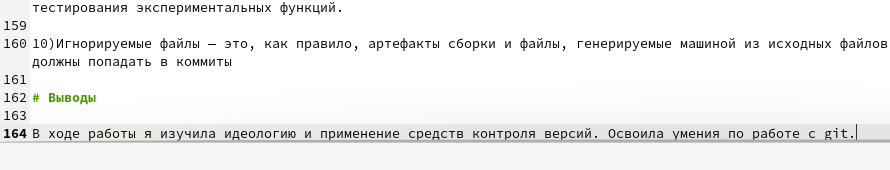
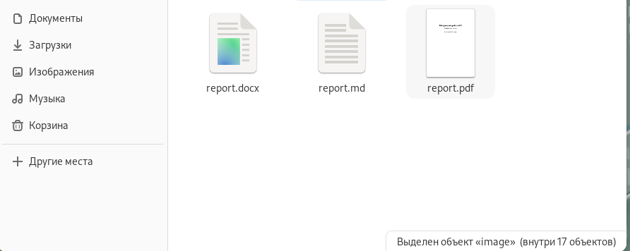

---
## Front matter
lang: ru-RU
title: Лабораторная работа №3
subtitle: Операционные системы
author:
  - Кирилюк С. А.
institute:
  - Российский университет дружбы народов, Москва, Россия
  - Физико-математический факультет, НММбд-01-22
date: 24 февраля 2023

## i18n babel
babel-lang: russian
babel-otherlangs: english

## Formatting pdf
toc: false
toc-title: Содержание
slide_level: 2
aspectratio: 169
section-titles: true
theme: metropolis
header-includes:
 - \metroset{progressbar=frametitle,sectionpage=progressbar,numbering=fraction}
 - '\makeatletter'
 - '\beamer@ignorenonframefalse'
 - '\makeatother'
---

# Информация

## Докладчик

:::::::::::::: {.columns align=center}
::: {.column width="70%"}

  * Кирилюк Светлана Алексеевна
  * студент физико-математического факуьтета
  * направление математика и механика
  * Российский университет дружбы народов

:::
::: {.column width="30%"}

:::
::::::::::::::

# Вводная часть

## Цели

- Научиться оформлять отчёты с помощью легковесного языка разметки Markdown

## Задачи

- Сделайте отчёт по предыдущей лабораторной работе в формате Markdown
- В качестве отчёта просьба предоставить отчёты в 3 форматах: pdf, docx и md (в архиве, поскольку он должен содержать скриншоты, Makefile и т.д.)

# Ход работы

## Генерируем отчёты в 3-х форматах

В первую очередь я задала путь до каталога “report” в каталоге “lab02”, после чего я ввела команду “make”, чтобы сгенерировать отчёты в 3-х форматах. Затем я ввела команду “gedit report.md”, чтобы открыть шаблон отчёта.

:::
::::::::::::::

## Заголовок, подзаголовок, автор

После открытия шаблона отчёта я начинаю редактирование с изменения заголовка, подзаголовка и автора отчёта.

:::
::::::::::::::

## Цели и задачи

Затем я переписываю цели и задание лабораторной работы.

:::
::::::::::::::

## Ход лабораторной работы

После чего перехожу к написанию хода лабораторной работы.

:::
::::::::::::::

## Ответы на контрольные вопросы

Также я добавляю ответы на контрольные вопросы.

:::
::::::::::::::

## Выводы 

Записываю выводы.

:::
::::::::::::::

## Сохранение изменений

Затем я сохраняю изменения и, вернувшись к терминалу, ввожу команду “make clean”, посчле чего генерируются измененные отчёты в трёх форматах.

:::
::::::::::::::

# Результаты работы

## Вывод

В ходе выполнения лабораторной работы я научилась оформлять отчёты с помощью легковесного языка разметки Markdown.

