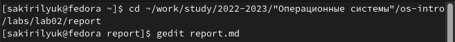
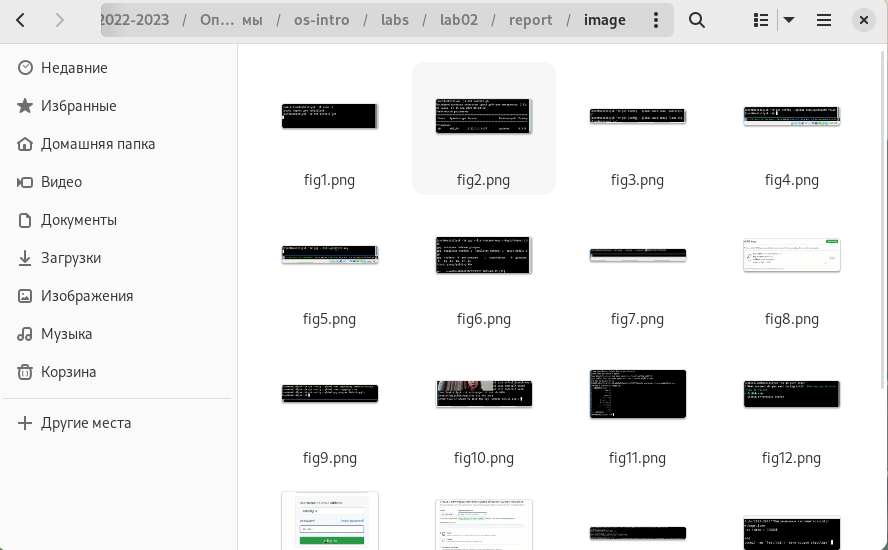
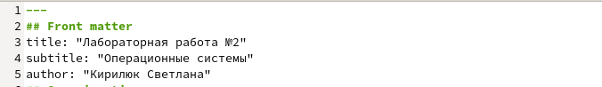
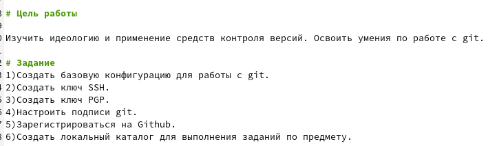
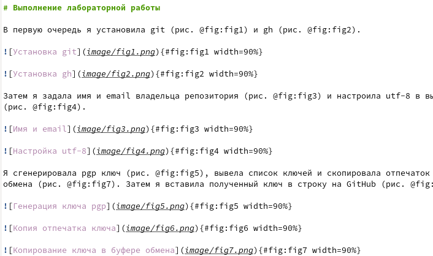
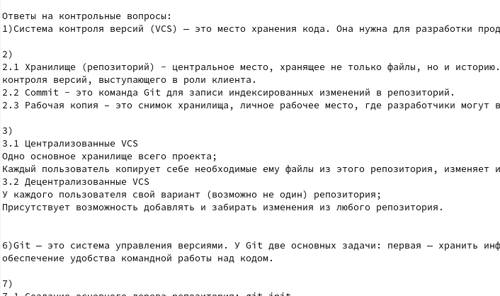
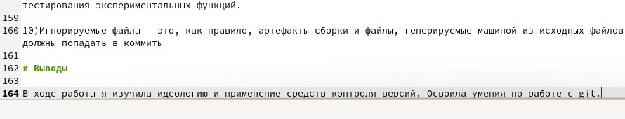
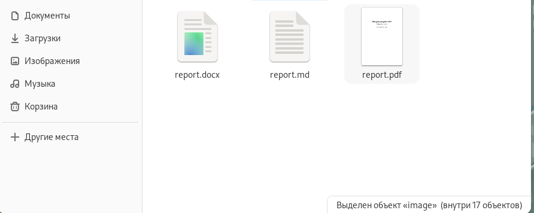

---
## Front matter
title: "Лабораторная работа №3"
subtitle: "Операционные системы"
author: "Кирилюк Светлана Алексеевна"

## Generic otions
lang: ru-RU
toc-title: "Содержание"

## Bibliography
bibliography: bib/cite.bib
csl: pandoc/csl/gost-r-7-0-5-2008-numeric.csl

## Pdf output format
toc: true # Table of contents
toc-depth: 2
lof: true # List of figures
lot: true # List of tables
fontsize: 12pt
linestretch: 1.5
papersize: a4
documentclass: scrreprt
## I18n polyglossia
polyglossia-lang:
  name: russian
  options:
	- spelling=modern
	- babelshorthands=true
polyglossia-otherlangs:
  name: english
## I18n babel
babel-lang: russian
babel-otherlangs: english
## Fonts
mainfont: PT Serif
romanfont: PT Serif
sansfont: PT Sans
monofont: PT Mono
mainfontoptions: Ligatures=TeX
romanfontoptions: Ligatures=TeX
sansfontoptions: Ligatures=TeX,Scale=MatchLowercase
monofontoptions: Scale=MatchLowercase,Scale=0.9
## Biblatex
biblatex: true
biblio-style: "gost-numeric"
biblatexoptions:
  - parentracker=true
  - backend=biber
  - hyperref=auto
  - language=auto
  - autolang=other*
  - citestyle=gost-numeric
## Pandoc-crossref LaTeX customization
figureTitle: "Рис."
tableTitle: "Таблица"
listingTitle: "Листинг"
lofTitle: "Список иллюстраций"
lotTitle: "Список таблиц"
lolTitle: "Листинги"
## Misc options
indent: true
header-includes:
  - \usepackage{indentfirst}
  - \usepackage{float} # keep figures where there are in the text
  - \floatplacement{figure}{H} # keep figures where there are in the text
---

# Цель работы

Научиться оформлять отчёты с помощью легковесного языка разметки Markdown.

# Задание

- Сделайте отчёт по предыдущей лабораторной работе в формате Markdown. 
- В качестве отчёта просьба предоставить отчёты в 3 форматах: pdf, docx и md (в архиве, поскольку он должен содержать скриншоты, Makefile и т.д.)

# Выполнение лабораторной работы

В первую очередь я задала путь до каталога "report" в каталоге "lab02", после чего я ввела команду "make", чтобы сгенерировать отчёты в 3-х форматах. Затем я ввела команду "gedit report.md", чтобы открыть шаблон отчёта (рис. @fig:fig1).

{#fig:fig1 width=90%}

Перед началом редактирования шаблона отчёта я переместила фотографии, которые будут использоваться в отчёте, в папку "image" каталога "report" (рис. @fig:fig2).

{#fig:fig2 width=90%}

После открытия шаблона отчёта я начинаю редактирование с изменения заголовка, подзаголовка и автора отчёта (рис. @fig:fig3). Затем я переписываю цели и задание лабораторной работы (рис. @fig:fig4), после чего перехожу к написанию хода лабораторной работы (рис. @fig:fig5). Также я добавляю ответы на контрольные вопросы (рис. @fig:fig6) и записываю выводы (рис. @fig:fig7). 

{#fig:fig3 width=90%}

{#fig:fig4 width=90%}

{#fig:fig5 width=90%}

{#fig:fig6 width=90%}

{#fig:fig7 width=90%}

Затем я сохраняю изменения и, вернувшись к терминалу, ввожу команду "make clean", посчле чего генерируются измененные отчёты в трёх форматах (рис. @fig:fig8).

{#fig:fig8 width=90%}

# Выводы

В ходе выполнения лабораторной работы я научилась оформлять отчёты с помощью легковесного языка разметки Markdown.
