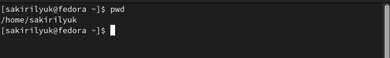
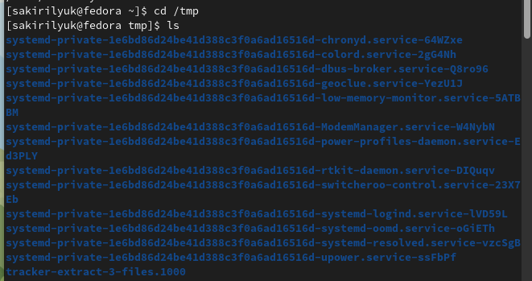
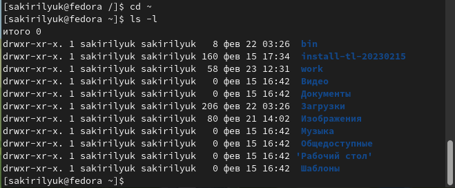
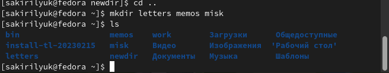
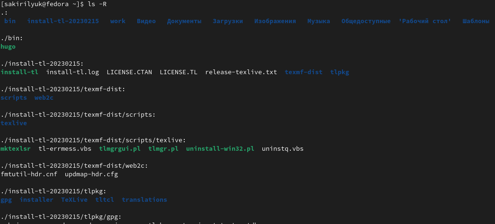
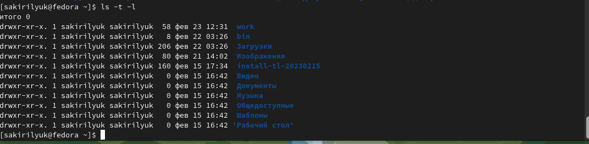
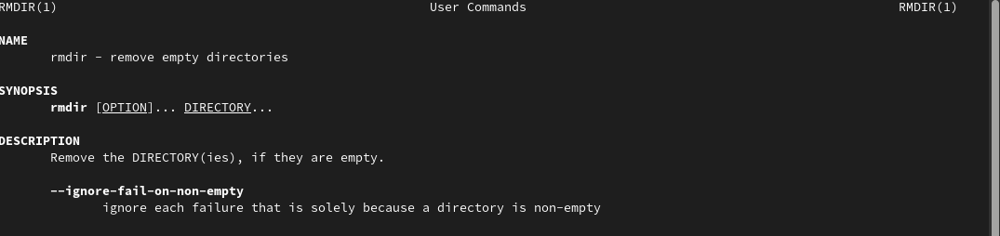
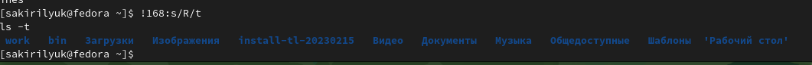

---
## Front matter
lang: ru-RU
title: Лабораторная работа №4
subtitle: Операционные системы
author:
  - Кирилюк С. А.
institute:
  - Российский университет дружбы народов, Москва, Россия
  - Факультет физико-матемтических наук
date: 04 марта 2023

## i18n babel
babel-lang: russian
babel-otherlangs: english

## Formatting pdf
toc: false
toc-title: Содержание
slide_level: 2
aspectratio: 169
section-titles: true
theme: metropolis
header-includes:
 - \metroset{progressbar=frametitle,sectionpage=progressbar,numbering=fraction}
 - '\makeatletter'
 - '\beamer@ignorenonframefalse'
 - '\makeatother'
---

# Информация

## Докладчик

:::::::::::::: {.columns align=center}
::: {.column width="70%"}

  * Кирилюк Светлана Алексеевна
  * студент физико-математического факультета
  * направление математика и механика
  * Российский университет дружбы народов

:::
::: {.column width="30%"}

:::
::::::::::::::

# Вводная часть

## Цели 

Приобретение практических навыков взаимодействия пользователя с системой посредством командной строки.

# Ход работы

## Домашний каталог

В первую очередь я определила полное имя своего домашнего каталога.

:::
::::::::::::::

## Команда "ls"

Затем я перешла в кааталог “tmp” и просмотрела его содержимое командой с разными опциями. Я также определила, есть ли в каталоге /var/spool подкаталог с именем cron. Далее я вывела на экран содержимое домашнего каталога и определила себя, как его владельца

:::
::::::::::::::

## Создание каталогов

В домашнем каталоге создала новый каталог с именем newdir, в нём создала новый каталог с именем morefun, в домашнем каталоге создала одной командой три новых каталога с именами letters, memos, misk. Затем удалила все созданные каталоги.

:::
::::::::::::::

## Команда "man"

С помощью команды man определила, какую опцию команды ls нужно использовать для просмотра содержимого каталога и подкаталогов, входящих в него. Затем, использовав ту же команду, определила набор опций команды ls, позволяющий отсортировать по времени последнего изменения выводимый список содержимого каталога с развёрнутым описанием файлов. Используя команду man, просмотрела описания следующих команд: cd, pwd, mkdir, rmdir, rm.

:::
::::::::::::::

## Команда "history"

Используя информацию, полученную при помощи команды history, выполнила модификацию и исполнение нескольких команд из буфера команд.

:::
::::::::::::::

## Результаты работы 

#Выводы

В ходе выполнения лабораторной работы я приобрела практические навыки взаимодействия пользователя с системой посредством командной строки.
