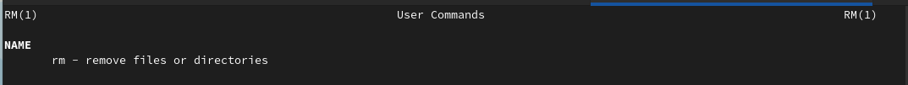

---
## Front matter
title: "Лабораторная работа №4"
subtitle: "Операционные системы"
author: "Кирилюк Светлана Алексеевна"

## Generic otions
lang: ru-RU
toc-title: "Содержание"

## Bibliography
bibliography: bib/cite.bib
csl: pandoc/csl/gost-r-7-0-5-2008-numeric.csl

## Pdf output format
toc: true # Table of contents
toc-depth: 2
lof: true # List of figures
lot: true # List of tables
fontsize: 12pt
linestretch: 1.5
papersize: a4
documentclass: scrreprt
## I18n polyglossia
polyglossia-lang:
  name: russian
  options:
	- spelling=modern
	- babelshorthands=true
polyglossia-otherlangs:
  name: english
## I18n babel
babel-lang: russian
babel-otherlangs: english
## Fonts
mainfont: PT Serif
romanfont: PT Serif
sansfont: PT Sans
monofont: PT Mono
mainfontoptions: Ligatures=TeX
romanfontoptions: Ligatures=TeX
sansfontoptions: Ligatures=TeX,Scale=MatchLowercase
monofontoptions: Scale=MatchLowercase,Scale=0.9
## Biblatex
biblatex: true
biblio-style: "gost-numeric"
biblatexoptions:
  - parentracker=true
  - backend=biber
  - hyperref=auto
  - language=auto
  - autolang=other*
  - citestyle=gost-numeric
## Pandoc-crossref LaTeX customization
figureTitle: "Рис."
tableTitle: "Таблица"
listingTitle: "Листинг"
lofTitle: "Список иллюстраций"
lotTitle: "Список таблиц"
lolTitle: "Листинги"
## Misc options
indent: true
header-includes:
  - \usepackage{indentfirst}
  - \usepackage{float} # keep figures where there are in the text
  - \floatplacement{figure}{H} # keep figures where there are in the text
---

# Цель работы

Приобретение практических навыков взаимодействия пользователя с системой посредством командной строки.

# Выполнение лабораторной работы

В первую очередь я определила полное имя своего домашнего каталога (рис. @fig:fig1).

{#fig:fig1 width=90%}

Затем я перешла в кааталог "tmp" и просмотрела его содержимое командой с разными опциями (рис. @fig:fig2), (рис. @fig:fig3), (рис. @fig:fig4), (рис. @fig:fig5).

{#fig:fig2 width=90%}

{#fig:fig3 width=90%}

{#fig:fig4 width=90%}

{#fig:fig5 width=90%}

Я определила, есть ли в каталоге /var/spool подкаталог с именем cron. Его там не оказалось (рис. @fig:fig6). Затем я вывела на экран содержимое домашнего каталога и определила себя, как его владельца (рис. @fig:fig7).

{#fig:fig6 width=90%}

{#fig:fig7 width=90%}

В домашнем каталоге создала новый каталог с именем newdir (рис. @fig:fig8), в каталоге ~/newdir создала новый каталог с именем morefun (рис. @fig:fig9), в домашнем каталоге создала одной командой три новых каталога с именами letters, memos, misk (рис. @fig:fig10). Затем удалила эти каталоги одной командой (рис. @fig:fig11).

{#fig:fig8 width=90%}

{#fig:fig9 width=90%}

{#fig:fig10 width=90%}

{#fig:fig11 width=90%}

Далее я удалила ранее созданный каталог ~/newdir командой rm. Проверила, был ли каталог удалён (рис. @fig:fig12). Также удалила каталог ~/newdir/morefun из домашнего каталога (рис. @fig:fig13).

{#fig:fig12 width=90%}

{#fig:fig13 width=90%}

С помощью команды man определила, какую опцию команды ls нужно использовать для просмотра содержимого каталога и подкаталогов, входящих в него (рис. @fig:fig14). Затем, использовав ту же команду, определила набор опций команды ls, позволяющий отсортировать по времени последнего изменения выводимый список содержимого каталога с развёрнутым описанием файлов (рис. @fig:fig15).

{#fig:fig14 width=90%}

{#fig:fig15 width=90%}

Используя команду man, просмотрела описания следующих команд: cd, pwd, mkdir, rmdir, rm (рис. @fig:fig16), (рис. @fig:fig17), (рис. @fig:fig18), (рис. @fig:fig19), (рис. @fig:fig20).

{#fig:fig16 width=90%}

{#fig:fig17 width=90%}

{#fig:fig18 width=90%}

{#fig:fig19 width=90%}

{#fig:fig20 width=90%}

Используя информацию, полученную при помощи команды history, выполнила модификацию и исполнение нескольких команд из буфера команд (рис. @fig:fig21), (рис. @fig:fig22), (рис. @fig:fig23).

{#fig:fig21 width=90%}

{#fig:fig22 width=90%}

{#fig:fig23 width=90%}

# Выводы

В ходе выполнения лабораторной работы я приобрела практические навыки взаимодействия пользователя с системой посредством командной строки.

