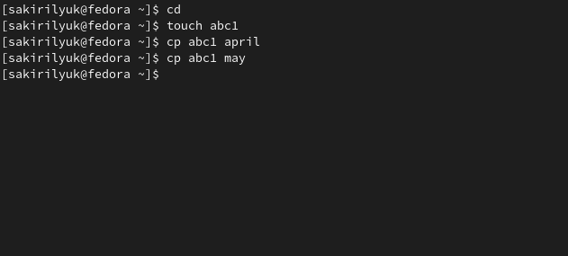
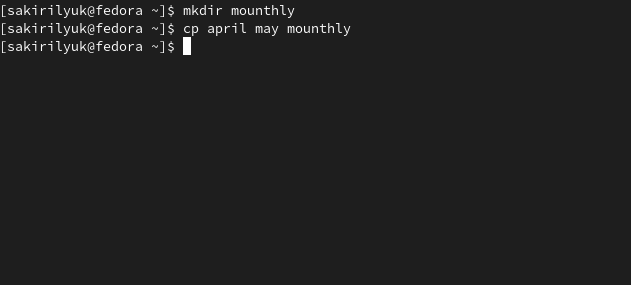
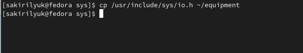
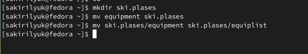
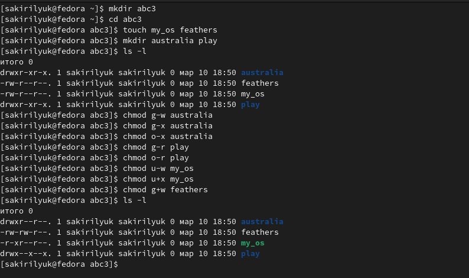
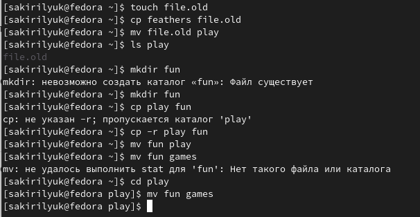
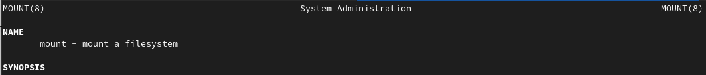
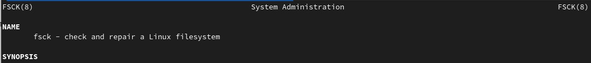

---
## Front matter
lang: ru-RU
title: Лабораторная работа №5
subtitle: Операционные системы
author:
  - Кирилюк С. А.
institute:
  - Российский университет дружбы народов, Москва, Россия
  - Физико-математический факультет
date: 10 марта 2023

## i18n babel
babel-lang: russian
babel-otherlangs: english

## Formatting pdf
toc: false
toc-title: Содержание
slide_level: 2
aspectratio: 169
section-titles: true
theme: metropolis
header-includes:
 - \metroset{progressbar=frametitle,sectionpage=progressbar,numbering=fraction}
 - '\makeatletter'
 - '\beamer@ignorenonframefalse'
 - '\makeatother'
---

# Информация

## Докладчик

:::::::::::::: {.columns align=center}
::: {.column width="70%"}

  * Кирилюк Светлана Алексеевна
  * студент физико-математического факультета
  * направление математика и механика
  * Российский университет дружбы народов
  
:::
::: {.column width="30%"}

:::
:::::::::::::: 

# Вводная часть

## Цели 

Ознакомление с файловой системой Linux, её структурой, именами и содержанием каталогов. Приобретение практических навыков по применению команд для работы с файлами и каталогами, по управлению процессами (и работами), по проверке использования диска и обслуживанию файловой системы.

# Ход работы

## Выполнение примеров 1-ой части лабы

:::
::::::::::::::

## Работа с каталогами

На этом этапе я создавала директории, файлы, перемещалаих, копировала и переименовывала

:::
::::::::::::::

## Опции команды "chmod"

Я создала необходимые каталоги и файлы и определила опции команды chmod, необходимые для того, чтобы присвоить каталогам и файлам выделенные права доступа.

:::
::::::::::::::

## Работа с каталогами и файлами и команда "chmod"

Я снова создавала, копировала и перемещала файлы на этом этапе. А также лишала владельца файлов прав на чтение и выполнение каталогов, а затем пробовала выполнять различные команды с файлами.

:::
::::::::::::::

## Команда "man"

Я прочитала man по командам mount, fsck, mkfs, kill и кратко их охарактеризовала.

:::
::::::::::::::

# Результаты

## Выводы

В ходе лабораторной работы я ознакомилась с файловой системой Linux, её структурой, именами и содержанием каталогов. Приобрела практические навыки по применению команд для работы с файлами и каталогами, по управлению процессами (и работами), по проверке использования диска и обслуживанию файловой системы.

