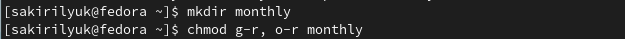

---
## Front matter
title: "Лабораторная работа №5"
subtitle: "Операционные системы"
author: "Кирилюк Светлана Алексеевна"

## Generic otions
lang: ru-RU
toc-title: "Содержание"

## Bibliography
bibliography: bib/cite.bib
csl: pandoc/csl/gost-r-7-0-5-2008-numeric.csl

## Pdf output format
toc: true # Table of contents
toc-depth: 2
lof: true # List of figures
lot: true # List of tables
fontsize: 12pt
linestretch: 1.5
papersize: a4
documentclass: scrreprt
## I18n polyglossia
polyglossia-lang:
  name: russian
  options:
	- spelling=modern
	- babelshorthands=true
polyglossia-otherlangs:
  name: english
## I18n babel
babel-lang: russian
babel-otherlangs: english
## Fonts
mainfont: PT Serif
romanfont: PT Serif
sansfont: PT Sans
monofont: PT Mono
mainfontoptions: Ligatures=TeX
romanfontoptions: Ligatures=TeX
sansfontoptions: Ligatures=TeX,Scale=MatchLowercase
monofontoptions: Scale=MatchLowercase,Scale=0.9
## Biblatex
biblatex: true
biblio-style: "gost-numeric"
biblatexoptions:
  - parentracker=true
  - backend=biber
  - hyperref=auto
  - language=auto
  - autolang=other*
  - citestyle=gost-numeric
## Pandoc-crossref LaTeX customization
figureTitle: "Рис."
tableTitle: "Таблица"
listingTitle: "Листинг"
lofTitle: "Список иллюстраций"
lotTitle: "Список таблиц"
lolTitle: "Листинги"
## Misc options
indent: true
header-includes:
  - \usepackage{indentfirst}
  - \usepackage{float} # keep figures where there are in the text
  - \floatplacement{figure}{H} # keep figures where there are in the text
---

# Цель работы

Ознакомление с файловой системой Linux, её структурой, именами и содержанием каталогов. Приобретение практических навыков по применению команд для работы с файлами и каталогами, по управлению процессами (и работами), по проверке использования диска и обслуживанию файловой системы.

# Выполнение лабораторной работы

1) В первую очередь я выполнила все примеры из 1-ой части лабораторной работы (рис. @fig:fig1), (рис. @fig:fig2), (рис. @fig:fig3), (рис. @fig:fig4), (рис. @fig:fig5), (рис. @fig:fig6), (рис. @fig:fig7), (рис. @fig:fig8), (рис. @fig:fig9), (рис. @fig:fig10), (рис. @fig:fig11), (рис. @fig:fig12).

{#fig:fig1 width=90%}

{#fig:fig2 width=90%}

{#fig:fig3 width=90%}

{#fig:fig4 width=90%}

{#fig:fig5 width=90%}

{#fig:fig6 width=90%}

{#fig:fig7 width=90%}

{#fig:fig8 width=90%}

{#fig:fig9 width=90%}

{#fig:fig10 width=90%}

{#fig:fig11 width=90%}

{#fig:fig12 width=90%}

2) Затем я скопировала файл /usr/include/sys/io.h в домашний каталог и назвала его equipment (рис. @fig:fig13). В домашнем каталоге создала директорию ~/ski.plases, переместила файл equipment в каталог ~/ski.plases и переименовала файл ~/ski.plases/equipment в ~/ski.plases/equiplist (рис. @fig:fig14).

{#fig:fig13 width=90%}

{#fig:fig14 width=90%}

Далее я создала в домашнем каталоге файл abc2 и скопировала его в каталог ~/ski.plases, назвала его equiplist2 (рис. @fig:fig15). Также создала каталог с именем equipment в каталоге ~/ski.plases (рис. @fig:fig16) и переместила файлы ~/ski.plases/equiplist и equiplist2 в каталог ~/ski.plases/equipment (рис. @fig:fig17).

{#fig:fig15 width=90%}

{#fig:fig16 width=90%}

{#fig:fig17 width=90%}

Я создала и переместила каталог ~/newdir в каталог ~/ski.plases и назвала его plans (рис. @fig:fig18).

{#fig:fig18 width=90%}

3) Я создала необходимые каталоги и файлы и определила опции команды chmod, необходимые для того, чтобы присвоить каталогам и файлам выделенные права доступа, считая, что в начале таких прав нет (рис. @fig:fig19).

{#fig:fig19 width=90%}

4) Затем я просмотрела содержимое файла /etc/password, файла не оказалось (рис. @fig:fig20). После чего я скопировала файл ~/feathers в файл ~/file.old, переместила файл ~/file.old в каталог ~/play., скопировала каталог ~/play в каталог ~/fun и выполнила премещение каталога ~/fun в каталог ~/play, назвав его games (рис. @fig:fig21).

{#fig:fig20 width=90%}

{#fig:fig21 width=90%}

Далее я лишила владельца файла ~/feathers права на чтение (рис. @fig:fig22). Затем проверила, что произойдёт, если попытаться просмотреть файл ~/feathers командой cat или скопировать его (рис. @fig:fig23).После чего вернула владельцу файла ~/feathers право на чтение (рис. @fig:fig24).

{#fig:fig22 width=90%}

{#fig:fig23 width=90%}

{#fig:fig24 width=90%}

Также я лишила владельца каталога ~/play права на выполнение (рис. @fig:fig25) и попробовала прейти в каталог, что не получилось сделать (рис. @fig:fig26). Затем отдала владельцу каталога ~/play право на выполнение (рис. @fig:fig27).

{#fig:fig25 width=90%}

{#fig:fig26 width=90%}

{#fig:fig27 width=90%}

5) В заключение я прочитала man по командам mount, fsck, mkfs, kill и кратко их охарактеризовала (рис. @fig:fig28), (рис. @fig:fig29), (рис. @fig:fig30), (рис. @fig:fig31).

{#fig:fig28 width=90%}

{#fig:fig29 width=90%}

{#fig:fig30 width=90%}

{#fig:fig31 width=90%}

# Выводы

В ходе лабораторной работы я ознакомилась с файловой системой Linux, её структурой, именами и содержанием каталогов. Приобрела практические навыки по применению команд для работы с файлами и каталогами, по управлению процессами (и работами), по проверке использования диска и обслуживанию файловой системы.

