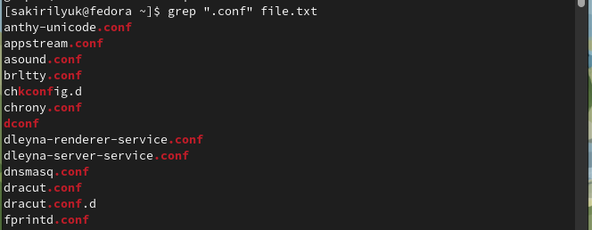
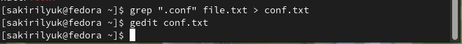
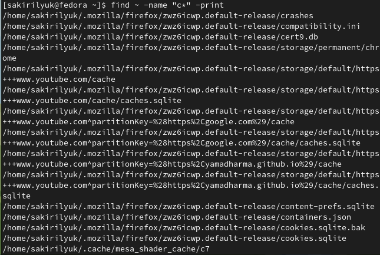
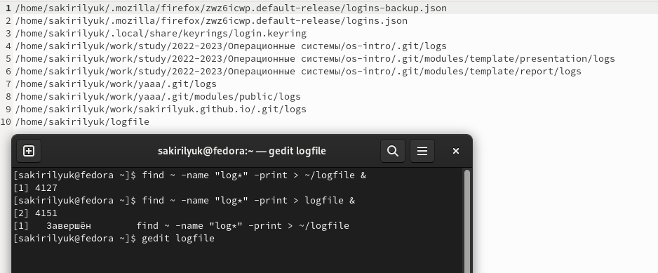
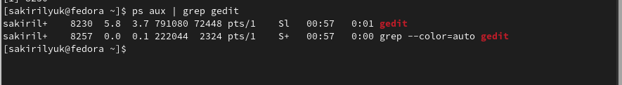
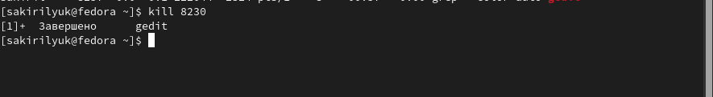
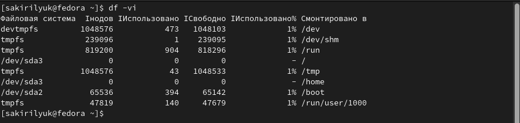
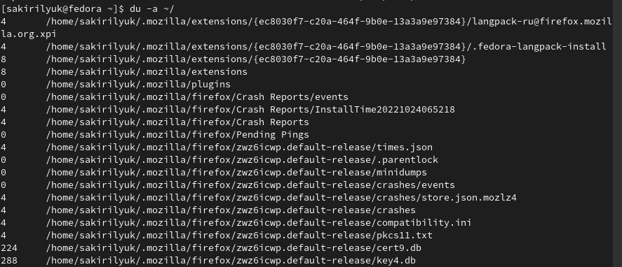
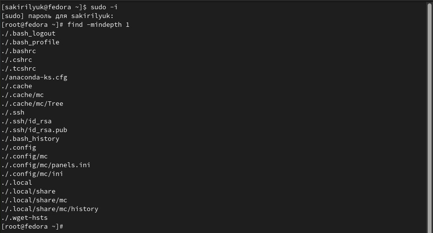

---
## Front matter
lang: ru-RU
title: Лабораторная работа №6
subtitle: Операционные системы
author:
  - Кирилюк С. А.
institute:
  - Российский университет дружбы народов, Москва, Россия
  - Физико-математический факультет
date: 17 марта 2023

## i18n babel
babel-lang: russian
babel-otherlangs: english

## Formatting pdf
toc: false
toc-title: Содержание
slide_level: 2
aspectratio: 169
section-titles: true
theme: metropolis
header-includes:
 - \metroset{progressbar=frametitle,sectionpage=progressbar,numbering=fraction}
 - '\makeatletter'
 - '\beamer@ignorenonframefalse'
 - '\makeatother'
---

# Информация

## Докладчик

:::::::::::::: {.columns align=center}
::: {.column width="70%"}

  * Кирилюк Светлана Алексеевна
  * студент физико-математического факультета
  * направления математика и механика 
  * Российский университет дружбы народов

:::
::: {.column width="30%"}

:::
::::::::::::::

# Вводная часть

## Цели

Ознакомление с инструментами поиска файлов и фильтрации текстовых данных. Приобретение практических навыков: по управлению процессами (и заданиями), по проверке использования диска и обслуживанию файловых систем.

# Ход работы

## Изменение файла file.txt

я записала в файл file.txt названия файлов, содержащихся в каталоге /etc. Затем дописала в этот же файл названия файлов, содержащихся в моём домашнем каталоге.

:::
::::::::::::::

## Вывод файлов file.txt расширения .conf

Далее я вывела имена всех файлов из file.txt, имеющих расширение .conf, после чего записала их в новый текстовой файл conf.txt.

:::
::::::::::::::

## Определение файлов с именем на “c” и "h"
Я определила, какие файлы в моём домашнем каталоге имеют имена, начинающиеся с символа “c”. Также я вывела на экран имена файлов из каталога /etc, начинающиеся с символа “h”.

:::
::::::::::::::

## Запуск в фоновом режиме процесс с ~/logfile файлами

Затем запустила в фоновом режиме процесс, который записал в файл ~/logfile файлы, имена которых начинаются с “log”. После чего я удалила файл ~/logfile.

:::
::::::::::::::

## Редактор gedit в фоновом режиме

Затем я запустила из консоли в фоновом режиме редактор gedit. Определила идентификатор процесса gedit, используя команду ps, конвейер и фильтр grep. Далее я прочитала справку (man) команды kill, после чего использовала её для завершения процесса gedit.

:::
::::::::::::::

## Выполнение команды dv, du

Я получила подробную информацию команды df и команды du с помощью команды man. И поочереди выполнила обе команды.

:::
::::::::::::::

## Вывод имён директорий домашнего каталога

Также, воспользовавшись справкой команды find, я вывела имена всех директорий, имеющихся в моём домашнем каталоге.

:::
::::::::::::::

# Результаты

## Выводы

В ходе лабораторной работы я ознакомилась с инструментами поиска файлов и фильтрации текстовых данных. Приобрела практические навыки: по управлению процессами (и заданиями), по проверке использования диска и обслуживанию файловых систем.
