---
## Front matter
title: "Лабораторная работа №6"
subtitle: "Операционные системы"
author: "Кирилюк Светлана Алексеевна"

## Generic otions
lang: ru-RU
toc-title: "Содержание"

## Bibliography
bibliography: bib/cite.bib
csl: pandoc/csl/gost-r-7-0-5-2008-numeric.csl

## Pdf output format
toc: true # Table of contents
toc-depth: 2
lof: true # List of figures
lot: true # List of tables
fontsize: 12pt
linestretch: 1.5
papersize: a4
documentclass: scrreprt
## I18n polyglossia
polyglossia-lang:
  name: russian
  options:
	- spelling=modern
	- babelshorthands=true
polyglossia-otherlangs:
  name: english
## I18n babel
babel-lang: russian
babel-otherlangs: english
## Fonts
mainfont: PT Serif
romanfont: PT Serif
sansfont: PT Sans
monofont: PT Mono
mainfontoptions: Ligatures=TeX
romanfontoptions: Ligatures=TeX
sansfontoptions: Ligatures=TeX,Scale=MatchLowercase
monofontoptions: Scale=MatchLowercase,Scale=0.9
## Biblatex
biblatex: true
biblio-style: "gost-numeric"
biblatexoptions:
  - parentracker=true
  - backend=biber
  - hyperref=auto
  - language=auto
  - autolang=other*
  - citestyle=gost-numeric
## Pandoc-crossref LaTeX customization
figureTitle: "Рис."
tableTitle: "Таблица"
listingTitle: "Листинг"
lofTitle: "Список иллюстраций"
lotTitle: "Список таблиц"
lolTitle: "Листинги"
## Misc options
indent: true
header-includes:
  - \usepackage{indentfirst}
  - \usepackage{float} # keep figures where there are in the text
  - \floatplacement{figure}{H} # keep figures where there are in the text
---

# Цель работы

Ознакомление с инструментами поиска файлов и фильтрации текстовых данных. Приобретение практических навыков: по управлению процессами (и заданиями), по проверке использования диска и обслуживанию файловых систем.

# Выполнение лабораторной работы

1) В первую очередь я записала в файл file.txt названия файлов, содержащихся в каталоге /etc. Затем дописала в этот же файл названия файлов, содержащихся в моём домашнем каталоге (рис. @fig:fig1).

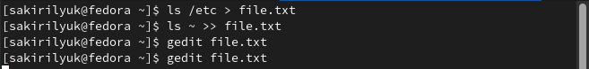{#fig:fig1 width=90%}

2) Далее я вывела имена всех файлов из file.txt, имеющих расширение .conf (рис. @fig:fig2), после чего записала их в новый текстовой файл conf.txt (рис. @fig:fig3).

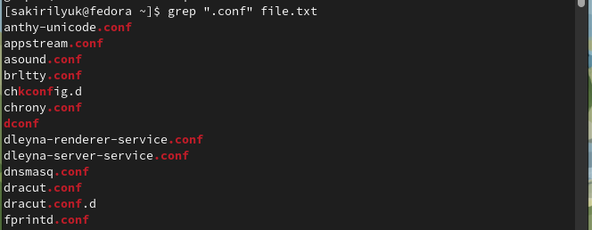{#fig:fig2 width=90%}

{#fig:fig3 width=90%}

3) Я определила, какие файлы в моём домашнем каталоге имеют имена, начинающиеся с символа "c" (рис. @fig:fig4).

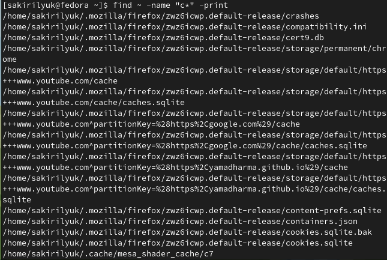{#fig:fig4 width=90%}

4) Также я вывела на экран имена файлов из каталога /etc, начинающиеся с символа "h" (рис. @fig:fig5).

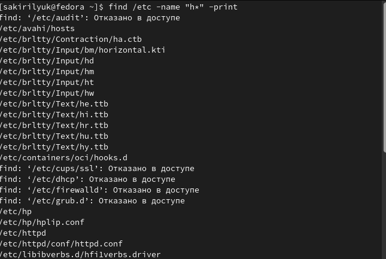{#fig:fig5 width=90%}

5) Затем запустила в фоновом режиме процесс, который записал в файл ~/logfile файлы, имена которых начинаются с "log" (рис. @fig:fig6).

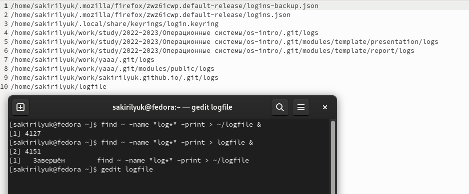{#fig:fig6 width=90%}

6) После чего я удалила файл ~/logfile (рис. @fig:fig7).

{#fig:fig7 width=90%}

7) Затем я запустила из консоли в фоновом режиме редактор gedit (рис. @fig:fig8).

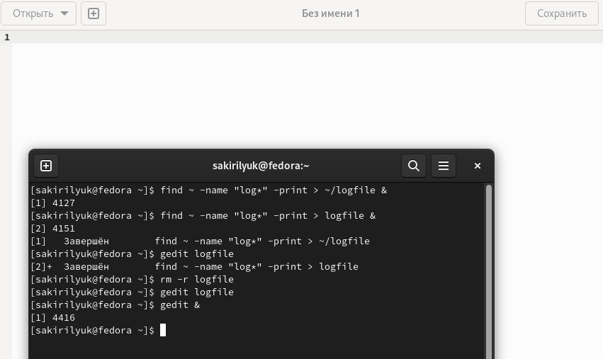{#fig:fig8 width=90%}

8) Определила идентификатор процесса gedit, используя команду ps, конвейер и фильтр grep (рис. @fig:fig9).

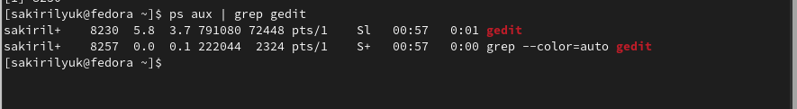{#fig:fig9 width=90%}

9) Далее я прочитала справку (man) команды kill (рис. @fig:fig10), после чего используйте её для завершения
процесса gedit (рис. @fig:fig11).

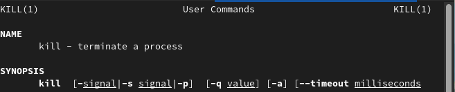{#fig:fig10 width=90%}

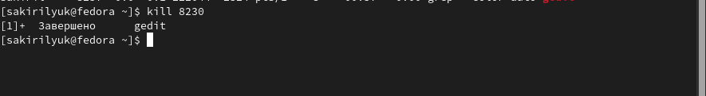{#fig:fig11 width=90%}

10) Я получила подробную информацию команды df (рис. @fig:fig12) и команды du (рис. @fig:fig13) с помощью команды man. И поочереди выполнила обе команды (рис. @fig:fig14), (рис. @fig:fig15).

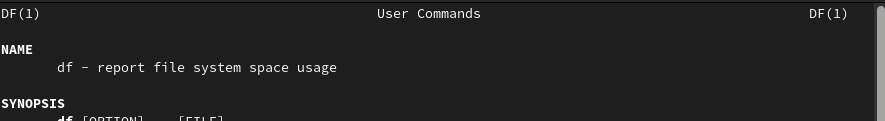{#fig:fig12 width=90%}

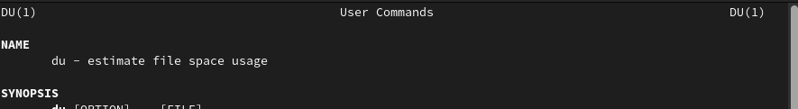{#fig:fig13 width=90%}

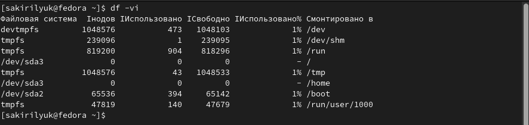{#fig:fig14 width=90%}

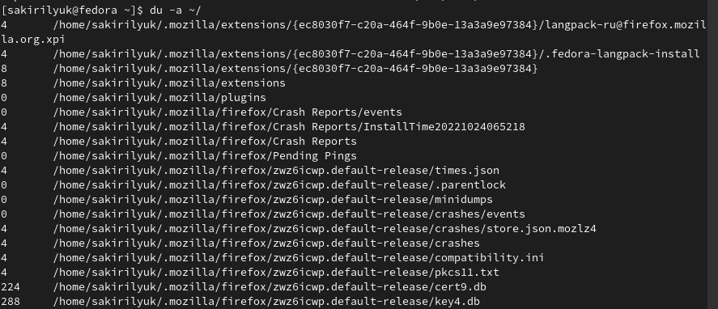{#fig:fig15 width=90%}

11) Также, воспользовавшись справкой команды find, я вывела имена всех директорий, имеющихся в моём домашнем каталоге (рис. @fig:fig16).

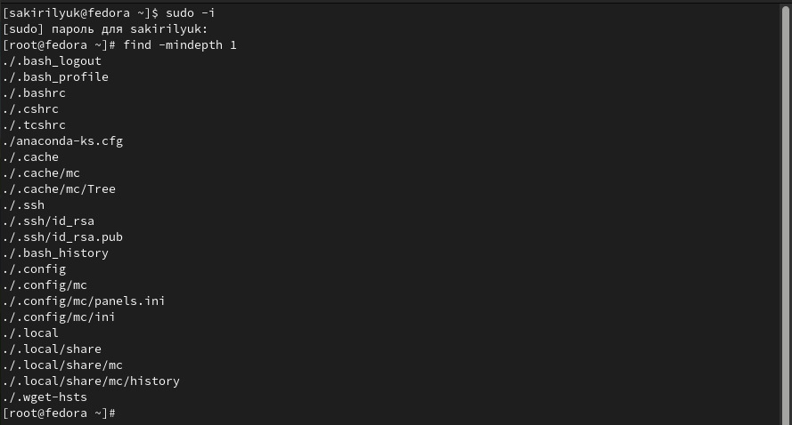{#fig:fig16 width=90%}

# Выводы

В ходе лабораторной работы я ознакомилась с инструментами поиска файлов и фильтрации текстовых данных. Приобрела практические навыки: по управлению процессами (и заданиями), по проверке использования диска и обслуживанию файловых систем.
