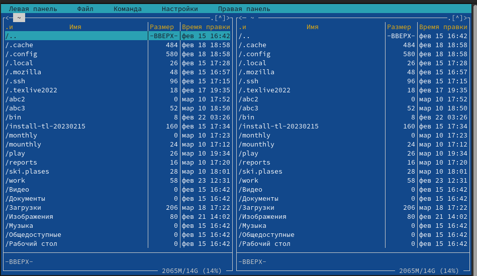
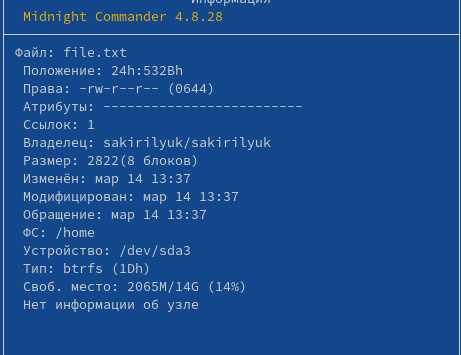
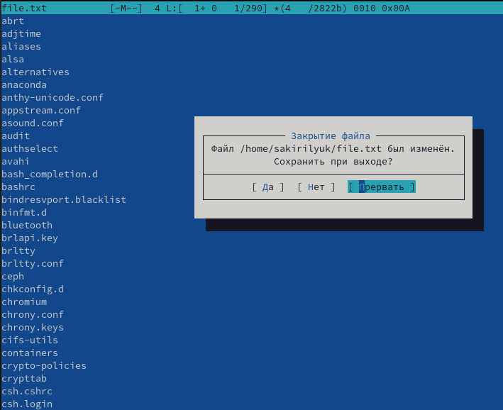
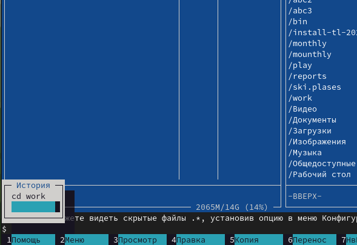
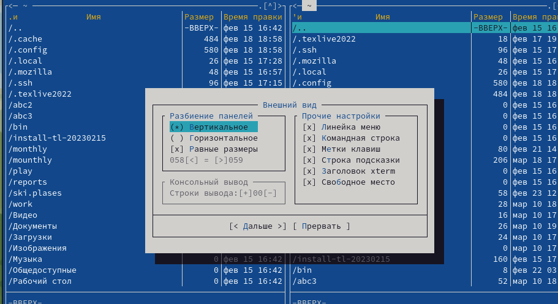
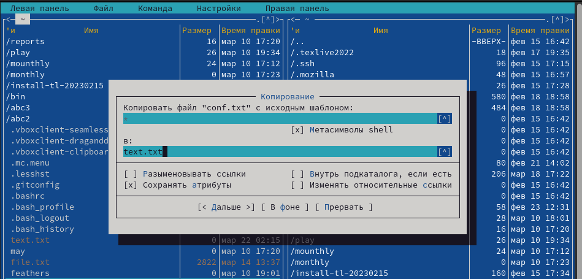
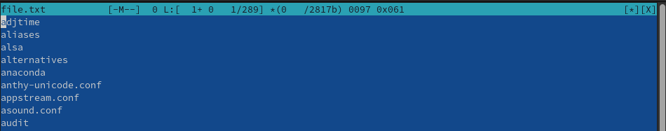
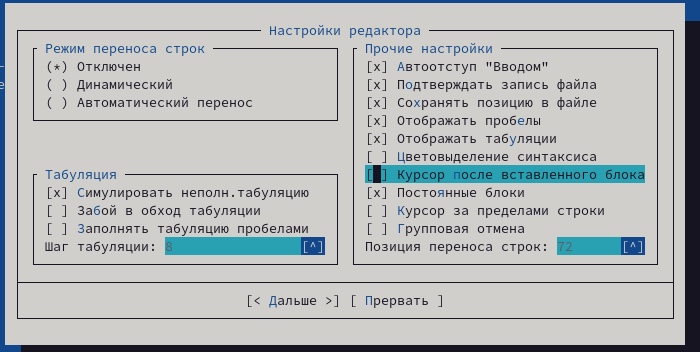

---
## Front matter
lang: ru-RU
title: Лабораторная работа №7
subtitle: Операционные системы 
author:
  - Кирилюк С. А.
institute:
  - Российский университет дружбы народов, Москва, Россия
  - Физико-математический факультет
date: 22 марта 2023

## i18n babel
babel-lang: russian
babel-otherlangs: english

## Formatting pdf
toc: false
toc-title: Содержание
slide_level: 2
aspectratio: 169
section-titles: true
theme: metropolis
header-includes:
 - \metroset{progressbar=frametitle,sectionpage=progressbar,numbering=fraction}
 - '\makeatletter'
 - '\beamer@ignorenonframefalse'
 - '\makeatother'
---

# Информация

## Докладчик

:::::::::::::: {.columns align=center}
::: {.column width="70%"}

  * Кирилюк Светлана Алексеевна
  * студент физико-математического факультета
  * направление математика и механика
  * Российский университет дружбы народов

:::
::: {.column width="30%"}

:::
::::::::::::::

# Вводная часть

## Цели 

Освоение основных возможностей командной оболочки Midnight Commander. Приобретение навыков практической работы по просмотру каталогов и файлов; манипуляций с ними.

# Ход работы

## Основная информация об mc

Я изучила информацию о mc, вызвав в командной строке man mc. После чего запустила из командной строки mc и изучила его структуру и меню. Выполнила несколько операций в mc, используя управляющие клавиши.

:::
::::::::::::::

## Левая панель

Затем выполнила основные команды меню левой панели. Информации о файлах выводилась достаточно подробно.

:::
::::::::::::::

## Подменю "файл"

Выбрав текстовый файл, я просмотрела его содержимое; отредактировала содержимое текстового файла; создала новый каталог и скопировала содержимое файла в созданный каталог.

:::
::::::::::::::

## Подменю "команда"

Я осуществила поиск в файловой системе файла с заданными условиями; выбрала и повторила одну из предыдущих команд; перешла в домашний каталог; проанализировала файла меню и файла расширений.

:::
::::::::::::::

## Подменю "настройки"

Вызвав подменю “настройки”, я освоила операции, определяющие структуру экрана mc.

:::
::::::::::::::

## Создание нового текстового файла

Затем создала новый текстовый файл, открыла его и вставила небольшой фрагмент текста, скопированный из другого файла.

:::
::::::::::::::

## Работа с текстом файла

Я проделала с текстом следующие манипуляции: удалила строку текста, выделила фрагмент текста и скопировала его на новую строку, сохранила изменения, отменила последнее действие, перешла сначала в конец файла, написала некоторый текст и проделала тоже самое с началом текста. Сохранила и закрыла файл.

:::
::::::::::::::

## Подсветка синтаксиса

Используя меню редактора, я выключила подсветку синтаксиса.

:::
::::::::::::::

# Результаты

## Выводы

В ходе работы я освоила основные возможности командной оболочки Midnight Commander. Приобрела навыки практической работы по просмотру каталогов и файлов; манипуляций с ними.

