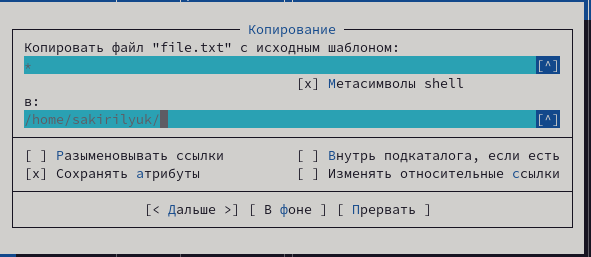

---
## Front matter
title: "Лабораторная работа №7"
subtitle: "Операционные системы"
author: "Кирилюк Светлана Алексеевна"

## Generic otions
lang: ru-RU
toc-title: "Содержание"

## Bibliography
bibliography: bib/cite.bib
csl: pandoc/csl/gost-r-7-0-5-2008-numeric.csl

## Pdf output format
toc: true # Table of contents
toc-depth: 2
lof: true # List of figures
lot: true # List of tables
fontsize: 12pt
linestretch: 1.5
papersize: a4
documentclass: scrreprt
## I18n polyglossia
polyglossia-lang:
  name: russian
  options:
	- spelling=modern
	- babelshorthands=true
polyglossia-otherlangs:
  name: english
## I18n babel
babel-lang: russian
babel-otherlangs: english
## Fonts
mainfont: PT Serif
romanfont: PT Serif
sansfont: PT Sans
monofont: PT Mono
mainfontoptions: Ligatures=TeX
romanfontoptions: Ligatures=TeX
sansfontoptions: Ligatures=TeX,Scale=MatchLowercase
monofontoptions: Scale=MatchLowercase,Scale=0.9
## Biblatex
biblatex: true
biblio-style: "gost-numeric"
biblatexoptions:
  - parentracker=true
  - backend=biber
  - hyperref=auto
  - language=auto
  - autolang=other*
  - citestyle=gost-numeric
## Pandoc-crossref LaTeX customization
figureTitle: "Рис."
tableTitle: "Таблица"
listingTitle: "Листинг"
lofTitle: "Список иллюстраций"
lotTitle: "Список таблиц"
lolTitle: "Листинги"
## Misc options
indent: true
header-includes:
  - \usepackage{indentfirst}
  - \usepackage{float} # keep figures where there are in the text
  - \floatplacement{figure}{H} # keep figures where there are in the text
---

# Цель работы

Освоение основных возможностей командной оболочки Midnight Commander. Приобретение навыков практической работы по просмотру каталогов и файлов; манипуляций с ними.

# Выполнение лабораторной работы

Я изучила информацию о mc, вызвав в командной строке man mc (рис. @fig:fig1). После чего запустила из командной строки mc и изучила его структуру и меню (рис. @fig:fig2).

{#fig:fig1 width=90%}

{#fig:fig2 width=90%}

Использовав управляющие клавиши, я выполнила несколько операций в mc: копирование (рис. @fig:fig3), перемещение (рис. @fig:fig4), получение информации о размере и правах доступа на файлы (рис. @fig:fig5).

{#fig:fig3 width=90%}

{#fig:fig4 width=90%}

{#fig:fig5 width=90%}

Затем выполнила основные команды меню левой панели. Информации о файлах выводилась достаточно подробно (рис. @fig:fig6), (рис. @fig:fig7), (рис. @fig:fig8).

{#fig:fig6 width=90%}

{#fig:fig7 width=90%}

{#fig:fig8 width=90%}

Далее я начала работу с подменю "файл". Выбрав текстовый файл, я просмотрела его содержимое (рис. @fig:fig9); отредактировала содержимое текстового файла (без сохранения результатов редактирования) (рис. @fig:fig10); создала новый каталог (рис. @fig:fig11) и скопировала содержимое файла в созданный каталог (рис. @fig:fig12).

{#fig:fig9 width=90%}

{#fig:fig10 width=90%}

{#fig:fig11 width=90%}

{#fig:fig12 width=90%}

После этого я изучила подменю "команда". С его помощью я осуществила поиск в файловой системе файла с заданными условиями (например, файла с расширением .c, содержащего строку main) (рис. @fig:fig13); выбрала и повторила одну из предыдущих команд (рис. @fig:fig14); перешла в домашний каталог (рис. @fig:fig15); проанализировала файла меню (рис. @fig:fig16) и файла расширений (рис. @fig:fig17).

{#fig:fig13 width=90%}

{#fig:fig14 width=90%}

{#fig:fig15 width=90%}

{#fig:fig16 width=90%}

{#fig:fig17 width=90%}

Вызвав подменю "настройки", я освоила операции, определяющие структуру экрана mc (рис. @fig:fig18).

{#fig:fig18 width=90%}

Затем создала новый текстовый файл (рис. @fig:fig19), открыла его (рис. @fig:fig20) и вставила небольшой фрагмент текста, скопированный из другого файла (рис. @fig:fig21).

{#fig:fig19 width=90%}

{#fig:fig20 width=90%}

{#fig:fig21 width=90%}

После чего я проделала с текстом следующие манипуляции: удалила строку текста (рис. @fig:fig22), выделила фрагмент текста и скопировала его на новую строку (рис. @fig:fig23), сохранила изменения (рис. @fig:fig24), отменила последнее действие (рис. @fig:fig25) и (рис. @fig:fig26), перешла сначала в конец файла (нажав комбинацию клавиш), написала некоторый текст и проделала тоже самое с началом текста (рис. @fig:fig27). Сохранила и закрыла файл.

{#fig:fig22 width=90%}

{#fig:fig23 width=90%}

{#fig:fig24 width=90%}

{#fig:fig25 width=90%}

{#fig:fig26 width=90%}

{#fig:fig27 width=90%}

Используя меню редактора, я выключила подсветку синтаксиса (рис. @fig:fig28).

{#fig:fig28 width=90%}

# Выводы

В ходе работы я освоила основные возможности командной оболочки Midnight Commander. Приобрела навыки практической работы по просмотру каталогов и файлов; манипуляций с ними.
