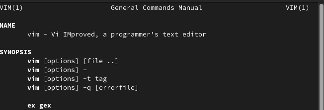
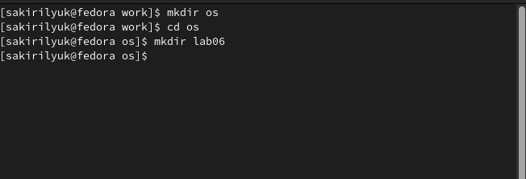
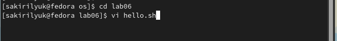
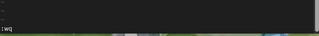
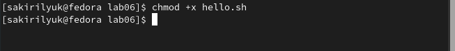
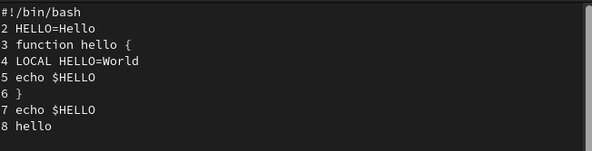
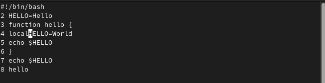

---
## Front matter
lang: ru-RU
title: Лабораторная работа №8
subtitle: Операционные системы 
author:
  - Кирилюк С. А.
institute:
  - Российский университет дружбы народов, Москва, Россия
  - Физико-математический факультет
date: 28 марта 2023

## i18n babel
babel-lang: russian
babel-otherlangs: english

## Formatting pdf
toc: false
toc-title: Содержание
slide_level: 2
aspectratio: 169
section-titles: true
theme: metropolis
header-includes:
 - \metroset{progressbar=frametitle,sectionpage=progressbar,numbering=fraction}
 - '\makeatletter'
 - '\beamer@ignorenonframefalse'
 - '\makeatother'
---

# Информация

## Докладчик

:::::::::::::: {.columns align=center}
::: {.column width="70%"}

  * Кирилюк Светлана Алексеевна
  * студент физико-математического факультета 
  * направление математика и механика
  * Российский университет дружбы народов

:::
::: {.column width="30%"}

:::
::::::::::::::

# Вводная часть

## Цели и задачи

Познакомиться с операционной системой Linux. Получить практические навыки работы с редактором vi, установленным по умолчанию практически во всех дистрибутивах.

# Ход работы 

## Ознакомление с редактором vi

В первую очередь я ознакомилась с редактором vi

:::
::::::::::::::

## Создание каталога

Затем я создала католог ~/work/os/lab06, перешла во вновь созданный каталог, вызвала vi и создала файл hello.sh.

:::
::::::::::::::

## Задание №1

Нажав клавишу “i”, я ввела текст, после чего нажала “:” для перехода в режим последней строки. Нажала w (записать) и q (выйти), а затем клавишу Enter для сохранения текста и завершения работы и сделала файл исполняемым.

:::
::::::::::::::

## Задание №2

Вызвав vi на редактирование файла, я заменила слово HELL на HELLO. Затем стерла слово LOCAL, после чего, перейдя
в режим вставки, набрала следующий текст: local. Установиы курсор на последней строке файла, я вставила после неё строку,
содержащую следующий текст: echo $HELLO, после чего удалила её. Выполнив команду отемны изменений, я сохранила файл.

:::
::::::::::::::

# Результаты

## Выводы

В ходе выполнения работы я познакомилась с операционной системой Linux. Получила практические навыки работы с редактором vi.
