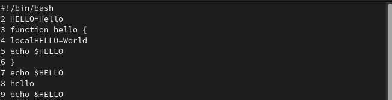

---
## Front matter
title: "Лабораторная работа №8"
subtitle: "Операционные системы"
author: "Кирилюк Светлана Алексеевна"

## Generic otions
lang: ru-RU
toc-title: "Содержание"

## Bibliography
bibliography: bib/cite.bib
csl: pandoc/csl/gost-r-7-0-5-2008-numeric.csl

## Pdf output format
toc: true # Table of contents
toc-depth: 2
lof: true # List of figures
lot: true # List of tables
fontsize: 12pt
linestretch: 1.5
papersize: a4
documentclass: scrreprt
## I18n polyglossia
polyglossia-lang:
  name: russian
  options:
	- spelling=modern
	- babelshorthands=true
polyglossia-otherlangs:
  name: english
## I18n babel
babel-lang: russian
babel-otherlangs: english
## Fonts
mainfont: PT Serif
romanfont: PT Serif
sansfont: PT Sans
monofont: PT Mono
mainfontoptions: Ligatures=TeX
romanfontoptions: Ligatures=TeX
sansfontoptions: Ligatures=TeX,Scale=MatchLowercase
monofontoptions: Scale=MatchLowercase,Scale=0.9
## Biblatex
biblatex: true
biblio-style: "gost-numeric"
biblatexoptions:
  - parentracker=true
  - backend=biber
  - hyperref=auto
  - language=auto
  - autolang=other*
  - citestyle=gost-numeric
## Pandoc-crossref LaTeX customization
figureTitle: "Рис."
tableTitle: "Таблица"
listingTitle: "Листинг"
lofTitle: "Список иллюстраций"
lotTitle: "Список таблиц"
lolTitle: "Листинги"
## Misc options
indent: true
header-includes:
  - \usepackage{indentfirst}
  - \usepackage{float} # keep figures where there are in the text
  - \floatplacement{figure}{H} # keep figures where there are in the text
---

# Цель работы

Познакомиться с операционной системой Linux. Получить практические навыки работы с редактором vi, установленным по умолчанию практически во всех дистрибутивах.

# Выполнение лабораторной работы

В первую очередь я ознакомилась с редактором vi (рис. @fig:fig1).

{#fig:fig1 width=90%}

Затем я создала католог ~/work/os/lab06 (рис. @fig:fig2), перешла во вновь созданный каталог, вызвала vi и создала файл hello.sh (рис. @fig:fig3).

{#fig:fig2 width=90%}

{#fig:fig3 width=90%}

Нажав клавишу "i", я ввела текст (рис. @fig:fig4) и нажала "Esc" для перехода в командный режим после завершения ввода текста. После чего нажала ":" для перехода в режим последней строки, и внизу экрана появилось приглашение в виде двоеточия (рис. @fig:fig5).

{#fig:fig4 width=90%}

{#fig:fig5 width=90%}

Нажала w (записать) и q (выйти), а затем клавишу Enter для сохранения текста и завершения работы (рис. @fig:fig6) и сделала файл исполняемым (рис. @fig:fig7).

{#fig:fig6 width=90%}

{#fig:fig7 width=90%}

Вызвав vi на редактирование файла, установила курсор в конец слова HELL второй строки и, перейдя в режим вставки, заменила на HELLO (рис. @fig:fig8). Затем установила курсор на четвертую строку и стерла слово LOCAL, после чего, перейдя в режим вставки, набрала следующий текст: local (рис. @fig:fig9).

{#fig:fig8 width=90%}

{#fig:fig9 width=90%}

Установиы курсор на последней строке файла, я вставила после неё строку, содержащую следующий текст: echo $HELLO (рис. @fig:fig10), после чего удалила её (рис. @fig:fig11).

{#fig:fig10 width=90%}

{#fig:fig11 width=90%}

Затем ввела команду отмены изменений u для отмены последней команды (рис. @fig:fig12) и сохранила изменения (рис. @fig:fig13).

{#fig:fig12 width=90%}

{#fig:fig13 width=90%}

# Выводы

В ходе выполнения работы я познакомилась с операционной системой Linux. Получила практические навыки работы с редактором vi.
