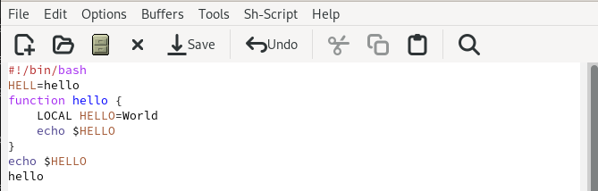
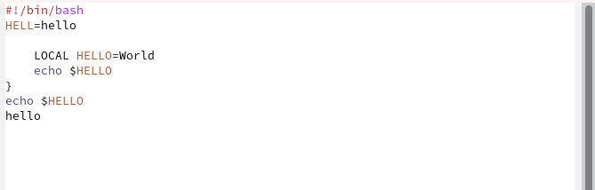
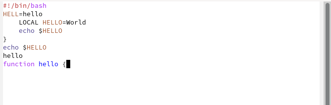
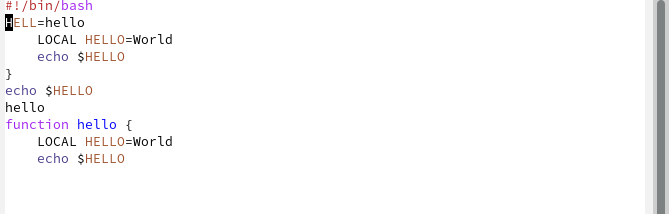
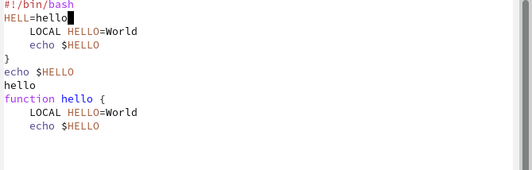
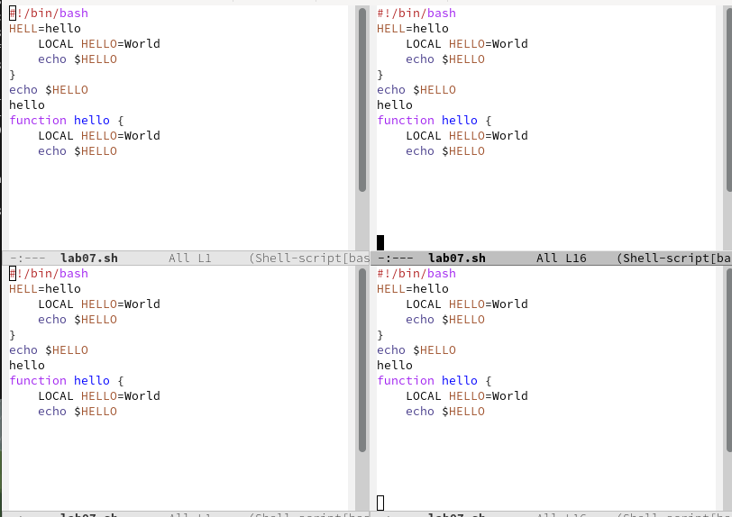
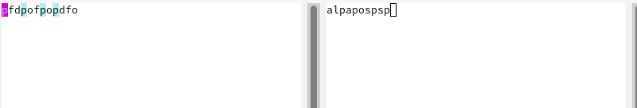

---
## Front matter
lang: ru-RU
title: Лабораторная работа №9
subtitle: Операционные системы
author:
  - Кирилюк С. А.
institute:
  - Российский университет дружбы народов, Москва, Россия
  - Физико-математический факультет
date: 08 апреля 2023

## i18n babel
babel-lang: russian
babel-otherlangs: english

## Formatting pdf
toc: false
toc-title: Содержание
slide_level: 2
aspectratio: 169
section-titles: true
theme: metropolis
header-includes:
 - \metroset{progressbar=frametitle,sectionpage=progressbar,numbering=fraction}
 - '\makeatletter'
 - '\beamer@ignorenonframefalse'
 - '\makeatother'
---

# Информация

## Докладчик

:::::::::::::: {.columns align=center}
::: {.column width="70%"}

  * Кирилюк Светлана Алексеевна
  * Студент физико-математического факультета
  * Направление математика и механика
  * Российский университет дружбы народов
  * [kulyabov-ds@rudn.ru](mailto:kulyabov-ds@rudn.ru)

:::
::: {.column width="30%"}

:::
::::::::::::::

# Вводная часть

## Цели

Познакомиться с операционной системой Linux. Получить практические навыки работы с редактором Emacs.

# Ход работы

## Создание файла 

Открыв emacs, я создала файл lab07.sh и набрала в нём текст. С помощью комбинации клавиш я сохранила набранный текст.

:::
::::::::::::::

## Работа с текстом

Я вырезала одной командой целую строку, вставила эту строку в конец файла; выделила область текста, скопировала её в буфер обмена и вставила область в конец файла; вновь выделила эту область и на этот раз вырезала её, отменила последнее действие.

:::
::::::::::::::

## Перемещение курсора

Переместила курсор в начало строки и в конец. Переместила курсор в начало и в конец буфера.

:::
::::::::::::::

## Буфера

Затем вывела список активных буферов на экран, переместилась во вновь открытое окно со списком открытых буферов и переключилась на другой буфер. После чего закрыла это окно и вновь переключилась между буферами, но уже без вывода их списка на экран. Я поделила фрейм на 4 части, в каждом из четырёх созданных окон открыла новый буфер и ввела строку текста.

:::
::::::::::::::

## Режим поиска

Переключившись в режим поиска, нашла несколько слов, присутствующих в тексте и переключилась между результатами поиска. Выйдя из режима поиска, перешла в режим поиска и замены, ввела текст, который следует найти и заменила, затем ввела текст для замены. И испробовала другой режим поиска.

:::
::::::::::::::

# Заключение

## Выводы

В ходе проделанной работы я познакомилась с операционной системой Linux. Получила практические навыки работы с редактором Emacs.
