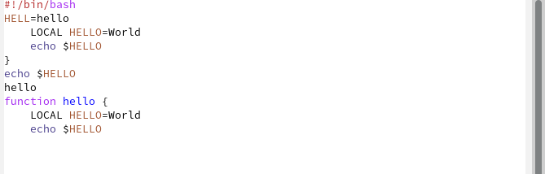

---
## Front matter
title: "Лабораторная работа №9"
subtitle: "Операционные системы"
author: "Кирилюк Светлана Алексеевна"

## Generic otions
lang: ru-RU
toc-title: "Содержание"

## Bibliography
bibliography: bib/cite.bib
csl: pandoc/csl/gost-r-7-0-5-2008-numeric.csl

## Pdf output format
toc: true # Table of contents
toc-depth: 2
lof: true # List of figures
lot: true # List of tables
fontsize: 12pt
linestretch: 1.5
papersize: a4
documentclass: scrreprt
## I18n polyglossia
polyglossia-lang:
  name: russian
  options:
	- spelling=modern
	- babelshorthands=true
polyglossia-otherlangs:
  name: english
## I18n babel
babel-lang: russian
babel-otherlangs: english
## Fonts
mainfont: PT Serif
romanfont: PT Serif
sansfont: PT Sans
monofont: PT Mono
mainfontoptions: Ligatures=TeX
romanfontoptions: Ligatures=TeX
sansfontoptions: Ligatures=TeX,Scale=MatchLowercase
monofontoptions: Scale=MatchLowercase,Scale=0.9
## Biblatex
biblatex: true
biblio-style: "gost-numeric"
biblatexoptions:
  - parentracker=true
  - backend=biber
  - hyperref=auto
  - language=auto
  - autolang=other*
  - citestyle=gost-numeric
## Pandoc-crossref LaTeX customization
figureTitle: "Рис."
tableTitle: "Таблица"
listingTitle: "Листинг"
lofTitle: "Список иллюстраций"
lotTitle: "Список таблиц"
lolTitle: "Листинги"
## Misc options
indent: true
header-includes:
  - \usepackage{indentfirst}
  - \usepackage{float} # keep figures where there are in the text
  - \floatplacement{figure}{H} # keep figures where there are in the text
---

# Цель работы

Познакомиться с операционной системой Linux. Получить практические навыки работы с редактором Emacs.

# Выполнение лабораторной работы

Открыв emacs, я создала файл lab07.sh и набрала в нём текст (рис. @fig:fig1).

{#fig:fig1 width=70%}

С помощью комбинации клавиш я сохранила набранный текст (рис. @fig:fig2).

{#fig:fig2 width=70%}

Затем проделала с текстом стандартные процедуры редактирования, каждое действие осуществляя комбинацией клавиш: вырезала одной командой целую строку (рис. @fig:fig3), вставила эту строку в конец файла (рис. @fig:fig4); выделила область текста, скопировала её в буфер обмена и вставила область в конец файла (рис. @fig:fig5); вновь выделила эту область и на этот раз вырезала её (рис. @fig:fig6), отменила последнее действие (рис. @fig:fig7).

{#fig:fig3 width=70%}

{#fig:fig4 width=70%}

{#fig:fig5 width=70%}

{#fig:fig6 width=70%}

{#fig:fig7 width=70%}

После чего Ннаучилась использовать команды по перемещению курсора. Переместила курсор в начало строки (рис. @fig:fig8).

{#fig:fig8 width=70%}

Переместила курсор в конец строки (рис. @fig:fig9).

{#fig:fig9 width=70%}

Переместила курсор в начало и в конец буфера.

Затем вывела список активных буферов на экран (рис. @fig:fig10), переместилась во вновь открытое окно со списком открытых буферов и переключилась на другой буфер (рис. @fig:fig11). После чего закрыла это окно и вновь переключилась между буферами, но уже без вывода их списка на экран.

{#fig:fig10 width=70%}

{#fig:fig11 width=70%}

Я поделила фрейм на 4 части: разделила фрейм на два окна по вертикали (рис. @fig:fig12), а затем каждое из этих окон на две части по горизонтали (рис. @fig:fig13).

{#fig:fig12 width=70%}

{#fig:fig13 width=70%}

В каждом из четырёх созданных окон открыла новый буфер и ввела строку текста (рис. @fig:fig14).

{#fig:fig14 width=70%}

Переключившись в режим поиска, нашла несколько слов, присутствующих в тексте и переключилась между результатами поиска, нажимая C-s (рис. @fig:fig15). Выйдя из режима поиска, нажав C-g, перешла в режим поиска и замены (M-%), ввела текст, который следует найти
и заменила, нажмите Enter , затем ввела текст для замены. Испробовала другой режим поиска, нажав M-s o.

{#fig:fig15 width=70%}

# Выводы

В ходе проделанной работы я познакомилась с операционной системой Linux. Получила практические навыки работы с редактором Emacs.

