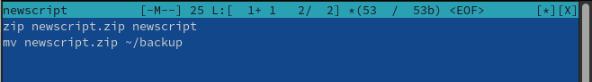
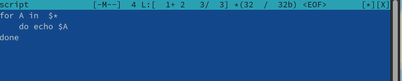
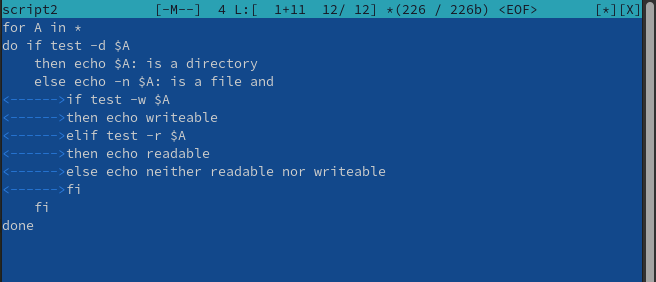
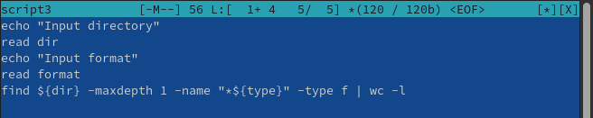

---
## Front matter
lang: ru-RU
title: Лабораторная работа №10
subtitle: Операционные системы
author:
  - Кирилюк С. А.
institute:
  - Российский университет дружбы народов, Москва, Россия
  - Физико-математический факультет
date: 15 апреля 2023

## i18n babel
babel-lang: russian
babel-otherlangs: english

## Formatting pdf
toc: false
toc-title: Содержание
slide_level: 2
aspectratio: 169
section-titles: true
theme: metropolis
header-includes:
 - \metroset{progressbar=frametitle,sectionpage=progressbar,numbering=fraction}
 - '\makeatletter'
 - '\beamer@ignorenonframefalse'
 - '\makeatother'
---

# Информация

## Докладчик

:::::::::::::: {.columns align=center}
::: {.column width="70%"}

  * Кирилюк Светлана Алексеевна
  * Студент физико-математического факультета
  * направление математика и механика
  * Российский университет дружбы народов

:::
::: {.column width="30%"}

:::
::::::::::::::

# Вводная часть

## Цели

Изучить основы программирования в оболочке ОС UNIX/Linux. Научиться писать небольшие командные файлы.

# Ход работы

## Работа с 1-ым файлом

Написала скрипт, который при запуске делает резервную копию самого себя. При этом файл архивируется архиватором zip.

:::
::::::::::::::

## Работа со 2-ым файлом

Я написала пример командного файла, обрабатывающего любое произвольное число аргументов командной строки, в том числе
превышающее десять.

:::
::::::::::::::

## Работа с 3-им файлом

Написала командный файл — аналог команды ls так, чтобы он выдавал информацию о нужном каталоге и выводил информацию
о возможностях доступа к файлам этого каталога.

:::
::::::::::::::

## Работа с 4-ым файлом

Написала командный файл, который получает в качестве аргумента командной строки формат файла и вычисляет количество
таких файлов в указанной директории.

:::
::::::::::::::

# Результаты

## Выводы

В ходе лабораторной работы я изучила основы программирования в оболочке ОС UNIX/Linux, научилась писать небольшие командные файлы.
