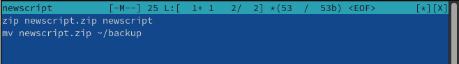
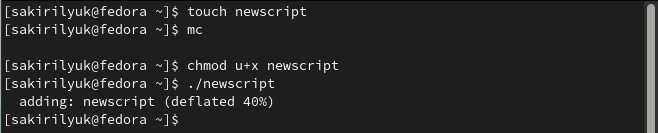
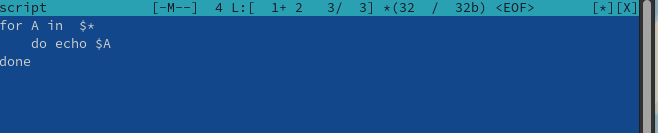
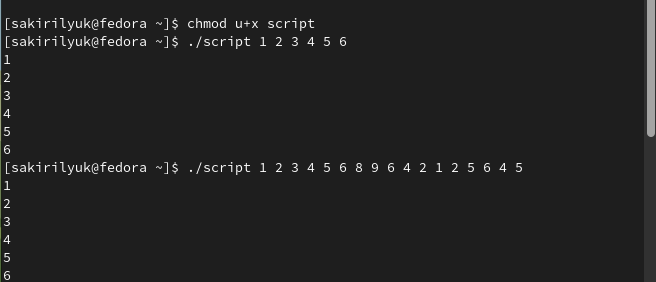
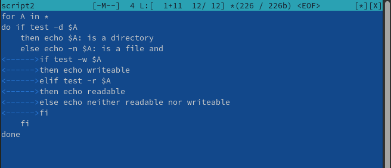
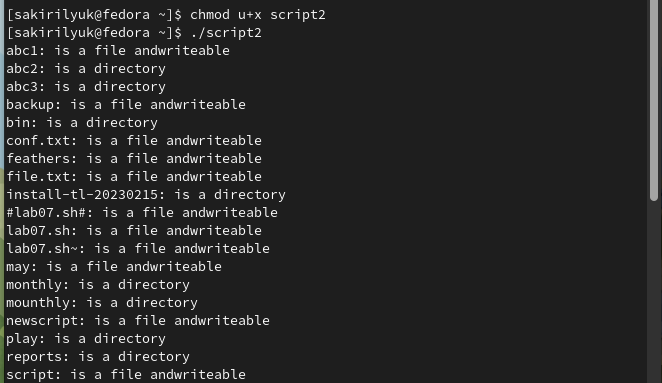
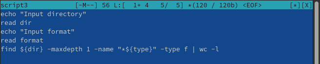
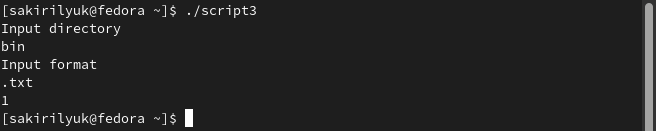

---
## Front matter
title: "Лабораторная работа №10"
subtitle: "Операционные системы"
author: "Кирилюк Светлана Алексеевна"

## Generic otions
lang: ru-RU
toc-title: "Содержание"

## Bibliography
bibliography: bib/cite.bib
csl: pandoc/csl/gost-r-7-0-5-2008-numeric.csl

## Pdf output format
toc: true # Table of contents
toc-depth: 2
lof: true # List of figures
lot: true # List of tables
fontsize: 12pt
linestretch: 1.5
papersize: a4
documentclass: scrreprt
## I18n polyglossia
polyglossia-lang:
  name: russian
  options:
	- spelling=modern
	- babelshorthands=true
polyglossia-otherlangs:
  name: english
## I18n babel
babel-lang: russian
babel-otherlangs: english
## Fonts
mainfont: PT Serif
romanfont: PT Serif
sansfont: PT Sans
monofont: PT Mono
mainfontoptions: Ligatures=TeX
romanfontoptions: Ligatures=TeX
sansfontoptions: Ligatures=TeX,Scale=MatchLowercase
monofontoptions: Scale=MatchLowercase,Scale=0.9
## Biblatex
biblatex: true
biblio-style: "gost-numeric"
biblatexoptions:
  - parentracker=true
  - backend=biber
  - hyperref=auto
  - language=auto
  - autolang=other*
  - citestyle=gost-numeric
## Pandoc-crossref LaTeX customization
figureTitle: "Рис."
tableTitle: "Таблица"
listingTitle: "Листинг"
lofTitle: "Список иллюстраций"
lotTitle: "Список таблиц"
lolTitle: "Листинги"
## Misc options
indent: true
header-includes:
  - \usepackage{indentfirst}
  - \usepackage{float} # keep figures where there are in the text
  - \floatplacement{figure}{H} # keep figures where there are in the text
---

# Цель работы

Изучить основы программирования в оболочке ОС UNIX/Linux. Научиться писать небольшие командные файлы.

# Выполнение лабораторной работы

Я создала файл newscript и написала скрипт, который при запуске делает резервную копию самого себя. При этом файл архивируется архиватором zip (рис. @fig:fig1). Затем я выполнила файл (рис. @fig:fig2) и проверила его (рис. @fig:fig3).

{#fig:fig1 width=70%}

{#fig:fig2 width=70%}

{#fig:fig3 width=70%}

Снова создав файл script, я написала пример командного файла, обрабатывающего любое произвольное число аргументов командной строки, в том числе превышающее десять (рис. @fig:fig4). Затем выполнила файл (рис. @fig:fig5).

{#fig:fig4 width=70%}

{#fig:fig5 width=70%}

Создала 3-ий файл script2 и написала командный файл — аналог команды ls так, чтобы он выдавал информацию о нужном каталоге
и выводил информацию о возможностях доступа к файлам этого каталога (рис. @fig:fig6), и выполнила его (рис. @fig:fig7).

{#fig:fig6 width=70%}

{#fig:fig7 width=70%}

Создала последний файл script3 и написала командный файл, который получает в качестве аргумента командной строки
формат файла и вычисляет количество таких файлов в указанной директории (рис. @fig:fig8), затем выполнила его (рис. @fig:fig9).

{#fig:fig8 width=70%}

{#fig:fig9 width=70%}

# Выводы

В ходе лабораторной работы я изучила основы программирования в оболочке ОС UNIX/Linux, научилась писать небольшие командные файлы.
