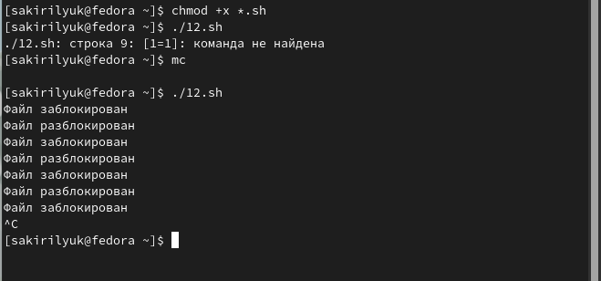
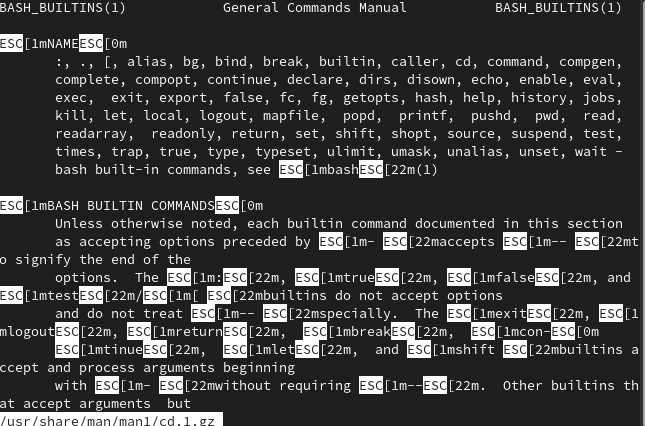
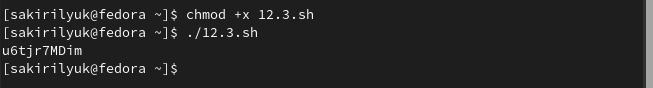

---
## Front matter
lang: ru-RU
title: Лабораторная работа №12
subtitle: Операционные системы
author:
  - Кирилюк С. А.
institute:
  - Российский университет дружбы народов, Москва, Россия
  - Физико-математический факультет
date: 29 апреля 2023

## i18n babel
babel-lang: russian
babel-otherlangs: english

## Formatting pdf
toc: false
toc-title: Содержание
slide_level: 2
aspectratio: 169
section-titles: true
theme: metropolis
header-includes:
 - \metroset{progressbar=frametitle,sectionpage=progressbar,numbering=fraction}
 - '\makeatletter'
 - '\beamer@ignorenonframefalse'
 - '\makeatother'
---

# Информация

## Докладчик

:::::::::::::: {.columns align=center}
::: {.column width="70%"}

  * Кирилюк Светлана Алексеевна
  * студент физико-математический факультета
  * направление математика и механика
  * Российский университет дружбы народов

:::
::: {.column width="30%"}

:::
::::::::::::::

# Вводная часть

## Цели и задачи

Изучить основы программирования в оболочке ОС UNIX. Научиться писать
более сложные командные файлы с использованием логических управляющих
конструкций и циклов.

# Ход работы

## Программа №1

Я создала файл и написала в нем скрипт 1-ой программы, затем выполнила её.

:::
::::::::::::::

## Программа №2

Создала второй файл, так жк написала скрипт к новой программе и выполнила её.

:::
::::::::::::::

## Программа №3

Создала последний файл и написала последний скрипт для программы №3.Выполнила её.

:::
::::::::::::::

# Заключение

## Выводы

В ходе лабораторной работы я изучила основы программирования в оболочке
ОС UNIX. Научилась писать более сложные командные файлы с использованием
логических управляющих конструкций и циклов.
