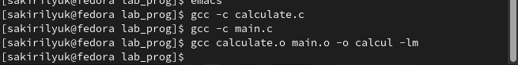
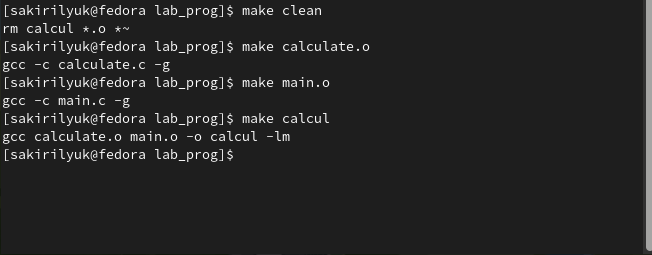
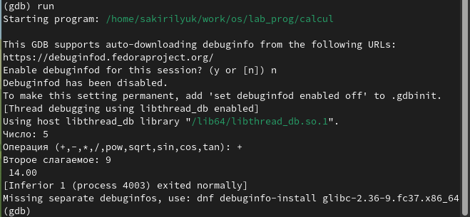
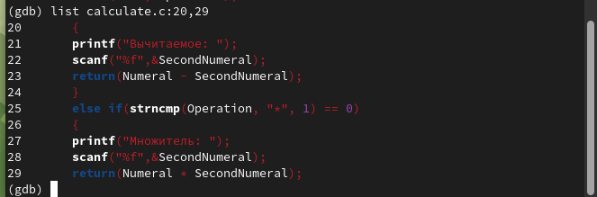
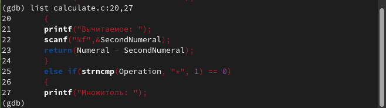
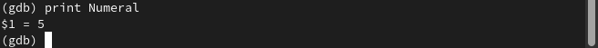
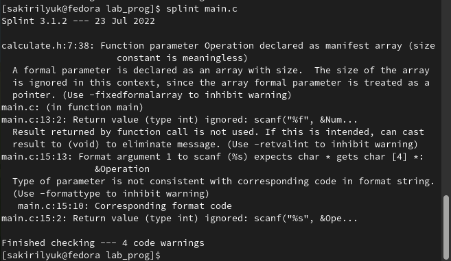

---
## Front matter
lang: ru-RU
title: Лабораторная работа №13
subtitle: Операционные системы
author:
  - Кирилюк С. А.
institute:
  - Российский университет дружбы народов, Москва, Россия
  - Физико-математический факультет
date: 06 мая 2023

## i18n babel
babel-lang: russian
babel-otherlangs: english

## Formatting pdf
toc: false
toc-title: Содержание
slide_level: 2
aspectratio: 169
section-titles: true
theme: metropolis
header-includes:
 - \metroset{progressbar=frametitle,sectionpage=progressbar,numbering=fraction}
 - '\makeatletter'
 - '\beamer@ignorenonframefalse'
 - '\makeatother'
---

# Информация

## Докладчик

:::::::::::::: {.columns align=center}
::: {.column width="70%"}

  * Кирилюк Светлана Алексеевна
  * студент физико-математического факультета
  * Направление математика и механика, НММбд-01-22
  * Российский университет дружбы народов

:::
::: {.column width="30%"}

:::
::::::::::::::

# Вводная часть

## Цель работы 

Приобрести простейшие навыки разработки, анализа, тестирования и отладки
приложений в ОС типа UNIX/Linux на примере создания на языке программиро-
вания С калькулятора с простейшими функциями.

# Ход работы

## Скрипты для файлов.

Я создала подкаталог в каталоге work и 3 файла в нём. Для них в редакторе я написала скрипты. После чего выполнила их компиляцию.

:::
::::::::::::::

## Файл Makefile

Затем создала Makefile и написала для него скрипт тоже, после чего изменила содержание этого файла и проверила его работу.

:::
::::::::::::::

## GDB отладчик

Запустив отладчик, я ввела команду run для запуска команды в нём.

:::
::::::::::::::

## Просмотр кода с командой list

Для постраничного (по 9 строк) просмотра исходного код использовала команду list, для просмотра строк с 12 по 15 основного файла - list с параметрами. Для просмотра определённых строк не основного файла так же использовала list с параметрами.

:::
::::::::::::::

## Точка останова

Затем установила точку останова в файле calculate.c на строке номер 21. После чего вывела информацию об имеющихся в проекте точек
останова. Я запустила программу внутри отладчика и убедилась, что программа остановилась в момент прохождения точки останова.

:::
::::::::::::::

## Переменная Numeral

Также я посмотрела, чему равно на этом этапе значение переменной Numeral. На экран было выведено число 5. Сравнила его с результатом вывода на экран после использования другой команды. После чего убрала точки останова.

:::
::::::::::::::

## Утилита Splint

с помощью утилиты splint я попробовала проанализировать коды файлов calculate.c и main.c.

:::
::::::::::::::

# Результаты

## Выводы

В ходе лабораторной работы я приобрела простейшие навыки разработки, ана-
лиза, тестирования и отладки приложений в ОС типа UNIX/Linux на примере
создания на языке программирования С калькулятора с простейшими функция-
ми.
