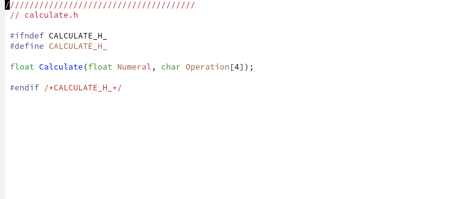

---
## Front matter
title: "Лабораторная работа №13"
subtitle: "Операционные системы"
author: "Кирилюк С. А."

## Generic otions
lang: ru-RU
toc-title: "Содержание"

## Bibliography
bibliography: bib/cite.bib
csl: pandoc/csl/gost-r-7-0-5-2008-numeric.csl

## Pdf output format
toc: true # Table of contents
toc-depth: 2
lof: true # List of figures
lot: true # List of tables
fontsize: 12pt
linestretch: 1.5
papersize: a4
documentclass: scrreprt
## I18n polyglossia
polyglossia-lang:
  name: russian
  options:
	- spelling=modern
	- babelshorthands=true
polyglossia-otherlangs:
  name: english
## I18n babel
babel-lang: russian
babel-otherlangs: english
## Fonts
mainfont: PT Serif
romanfont: PT Serif
sansfont: PT Sans
monofont: PT Mono
mainfontoptions: Ligatures=TeX
romanfontoptions: Ligatures=TeX
sansfontoptions: Ligatures=TeX,Scale=MatchLowercase
monofontoptions: Scale=MatchLowercase,Scale=0.9
## Biblatex
biblatex: true
biblio-style: "gost-numeric"
biblatexoptions:
  - parentracker=true
  - backend=biber
  - hyperref=auto
  - language=auto
  - autolang=other*
  - citestyle=gost-numeric
## Pandoc-crossref LaTeX customization
figureTitle: "Рис."
tableTitle: "Таблица"
listingTitle: "Листинг"
lofTitle: "Список иллюстраций"
lotTitle: "Список таблиц"
lolTitle: "Листинги"
## Misc options
indent: true
header-includes:
  - \usepackage{indentfirst}
  - \usepackage{float} # keep figures where there are in the text
  - \floatplacement{figure}{H} # keep figures where there are in the text
---

# Цель работы

Приобрести простейшие навыки разработки, анализа, тестирования и отладки приложений в ОС типа UNIX/Linux на примере создания на языке программирования С калькулятора с простейшими функциями.

# Выполнение лабораторной работы

Перед выполнением заданий в домашнем каталоге создала подкаталог ~/work/os/lab_prog., а также файлы: calculate.h, calculate.c, main.c.(рис. @fig:fig1).

{#fig:fig1 width=70%}

При помощи редактора для данных файлов написала скрипты (рис. @fig:fig2), (рис. @fig:fig3), (рис. @fig:fig4).

{#fig:fig2 width=70%}

{#fig:fig3 width=70%}

{#fig:fig4 width=70%}

После чего выполнила компиляцию программы посредством gcc (рис. @fig:fig5).

{#fig:fig5 width=70%}

Затем создала Makefile и написала для него скрипт (рис. @fig:fig6). Этот файл используется для автоматической компиляции main.c, calculate.c и создание из них исполняемого файла calcul. Помимо этого, в файле также есть функция ‘clean’, используемая для удаления всех файлов.

Затем я изменила его содержание (рис. @fig:fig7) и проверила его работу (рис. @fig:fig8).

{#fig:fig6 width=70%}

{#fig:fig7 width=70%}

{#fig:fig8 width=70%}

С помощью gdb я начала выполнение отладки программы calcul. Сначала я запустила отладчик GDB, загрузив в него программу для отладки (рис. @fig:fig9). Для запуска программы внутри отладчика ввела команду run (рис. @fig:fig10). 

{#fig:fig9 width=70%}

{#fig:fig10 width=70%}

Для постраничного (по 9 строк) просмотра исходного код использовала команду list (рис. @fig:fig11), для просмотра строк с 12 по 15 основного файла - list с параметрами (рис. @fig:fig12). Для просмотра определённых строк не основного файла так же использовала list с параметрами (рис. @fig:fig13).

{#fig:fig11 width=70%}

{#fig:fig12 width=70%}

{#fig:fig13 width=70%}

Затем установила точку останова в файле calculate.c на строке номер 21 (рис. @fig:fig14), (рис. @fig:fig15). После чего вывела информацию об имеющихся в проекте точек останова (рис. @fig:fig16). Я запустила программу внутри отладчика и убедилась, что программа остановилась в момент прохождения точки останова (рис. @fig:fig17).

{#fig:fig14 width=70%}

{#fig:fig15 width=70%}

{#fig:fig16 width=70%}

{#fig:fig17 width=70%}

Также я посмотрела, чему равно на этом этапе значение переменной Numeral (рис. @fig:fig18). На экран было выведено число 5. Сравнила его с результатом вывода на экран после использования другой команды (рис. @fig:fig19). После чего убрала точки останова (рис. @fig:fig20). 

{#fig:fig18 width=70%}

{#fig:fig19 width=70%}

{#fig:fig20 width=70%}

В заключение, с помощью утилиты splint я попробовала проанализировать коды файлов calculate.c (рис. @fig:fig21) и main.c (рис. @fig:fig22).

{#fig:fig21 width=70%}

{#fig:fig22 width=70%}

# Выводы

В ходе лабораторной работы я приобрела простейшие навыки разработки, анализа, тестирования и отладки приложений в ОС типа UNIX/Linux на примере создания на языке программирования С калькулятора с простейшими функциями.
