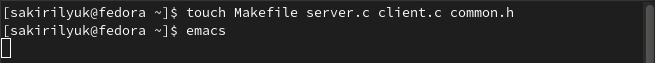
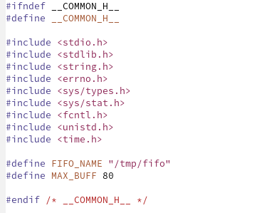
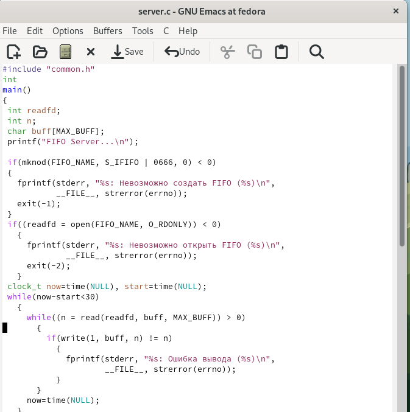
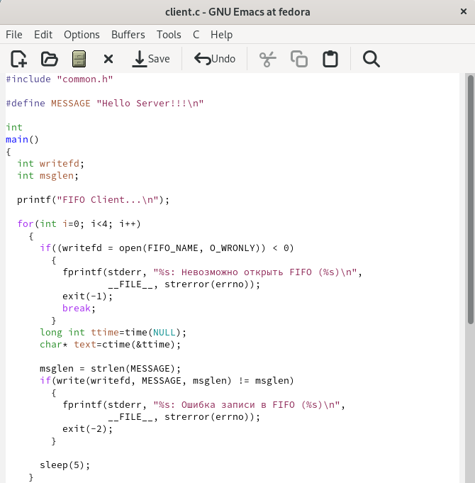
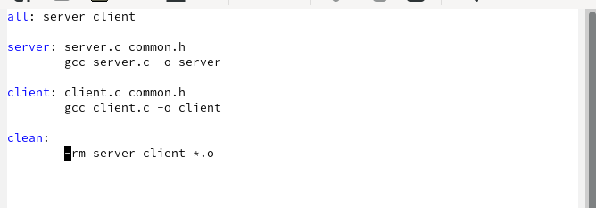
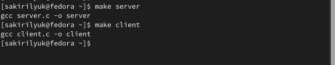
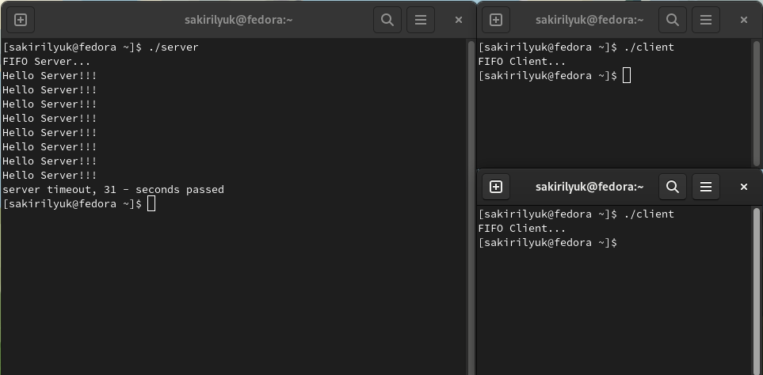

---
## Front matter
lang: ru-RU
title: Лабораторная работа №14
subtitle: Операционные системы
author:
  - Кирилюк С. А.
institute:
  - Российский университет дружбы народов, Москва, Россия
  - Физико-математический факультет
date: 13 мая 2023

## i18n babel
babel-lang: russian
babel-otherlangs: english

## Formatting pdf
toc: false
toc-title: Содержание
slide_level: 2
aspectratio: 169
section-titles: true
theme: metropolis
header-includes:
 - \metroset{progressbar=frametitle,sectionpage=progressbar,numbering=fraction}
 - '\makeatletter'
 - '\beamer@ignorenonframefalse'
 - '\makeatother'
---

# Информация

## Докладчик

:::::::::::::: {.columns align=center}
::: {.column width="70%"}

  * Кирилюк Светлана Алексеевна
  * студент физико-математического факультета
  * Направление математика и механика
  * Российский университет дружбы народов

:::
::: {.column width="30%"}

:::
::::::::::::::

# Вводная часть

## Цели

Приобретение практических навыков работы с именованными каналами.

# Ход работы

## Создание файлов

Для работы я создала 4 новых файла в домашнем каталоге.

:::
::::::::::::::

## common.h

Я перешла в файл common.h при помощи emacs и написала скрипт для него, исправив листинг.

:::
::::::::::::::

## server.c

Перейдя в файл server.c, я написала ему скрипт, так же отредактировав листинг.

:::
::::::::::::::

## client.c

Аналогично написала листинг для файла client.c.

:::
::::::::::::::

## Makefile

Листинг для Makefile просто переписала.

:::
::::::::::::::

## Компиляция файлов

Затем я выполнила компиляцию исполняемых файлов при помощи команд.

:::
::::::::::::::

## Проверка работы файлов

Я выполнила проверку работы файлов

:::
::::::::::::::

# Результаты

## Выводы

В ходе лабораторной работы я приобрела практические навыки работы с именованными каналами.
