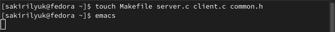
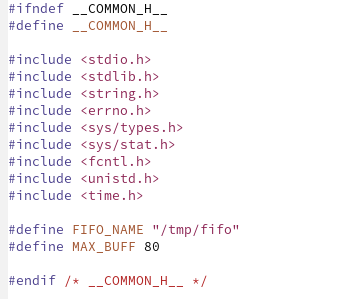
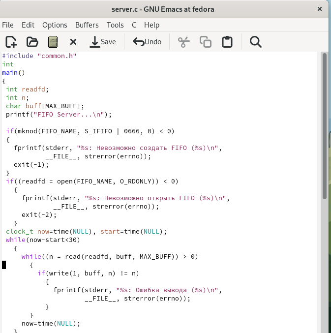
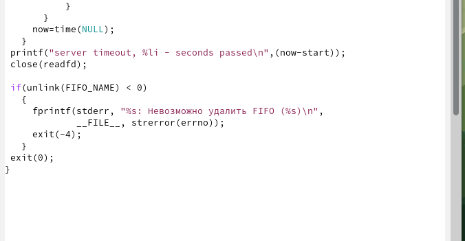
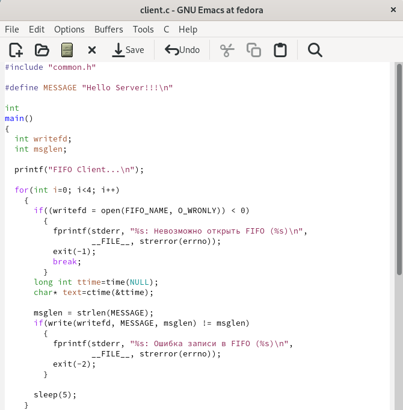
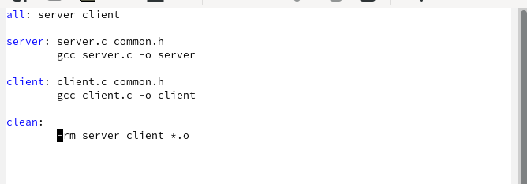
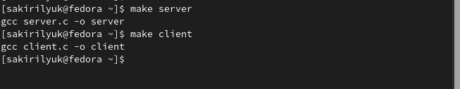
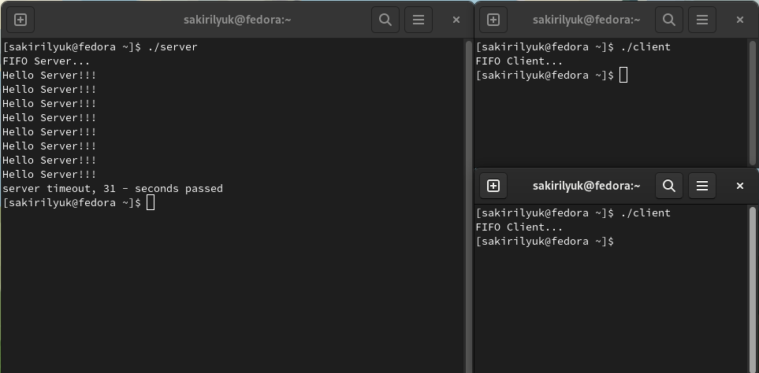

---
## Front matter
title: "Лабораторная работа №14"
subtitle: "Операционные системы"
author: "Кирилюк Светлана Алексеевна"

## Generic otions
lang: ru-RU
toc-title: "Содержание"

## Bibliography
bibliography: bib/cite.bib
csl: pandoc/csl/gost-r-7-0-5-2008-numeric.csl

## Pdf output format
toc: true # Table of contents
toc-depth: 2
lof: true # List of figures
lot: true # List of tables
fontsize: 12pt
linestretch: 1.5
papersize: a4
documentclass: scrreprt
## I18n polyglossia
polyglossia-lang:
  name: russian
  options:
	- spelling=modern
	- babelshorthands=true
polyglossia-otherlangs:
  name: english
## I18n babel
babel-lang: russian
babel-otherlangs: english
## Fonts
mainfont: PT Serif
romanfont: PT Serif
sansfont: PT Sans
monofont: PT Mono
mainfontoptions: Ligatures=TeX
romanfontoptions: Ligatures=TeX
sansfontoptions: Ligatures=TeX,Scale=MatchLowercase
monofontoptions: Scale=MatchLowercase,Scale=0.9
## Biblatex
biblatex: true
biblio-style: "gost-numeric"
biblatexoptions:
  - parentracker=true
  - backend=biber
  - hyperref=auto
  - language=auto
  - autolang=other*
  - citestyle=gost-numeric
## Pandoc-crossref LaTeX customization
figureTitle: "Рис."
tableTitle: "Таблица"
listingTitle: "Листинг"
lofTitle: "Список иллюстраций"
lotTitle: "Список таблиц"
lolTitle: "Листинги"
## Misc options
indent: true
header-includes:
  - \usepackage{indentfirst}
  - \usepackage{float} # keep figures where there are in the text
  - \floatplacement{figure}{H} # keep figures where there are in the text
---

# Цель работы

Приобретение практических навыков работы с именованными каналами.

# Выполнение лабораторной работы

Перед началом работы я создала 4 новых файла в рабочем каталоге (рис. @fig:fig1).

{#fig:fig1 width=70%}

Затем я перешла в файл common.h при помощи emacs и написала скрипт для него, исправив листинг (рис. @fig:fig2).

{#fig:fig2 width=70%}

Перейдя в файл server.c, я написала ему скрипт, так же отредактировав листинг (рис. @fig:fig3), (рис. @fig:fig4).

{#fig:fig3 width=70%}

{#fig:fig4 width=70%}

Аналогично написала листинг для файла client.c (рис. @fig:fig5), (рис. @fig:fig6).

{#fig:fig5 width=70%}

{#fig:fig6 width=70%}

Листинг для Makefile просто переписала (рис. @fig:fig7).

{#fig:fig7 width=70%}

Затем я выполнила компиляцию исполняемых файлов при помощи команд (рис. @fig:fig8).

{#fig:fig8 width=70%}

После чего я проверила работу файлов (рис. @fig:fig9).

{#fig:fig9 width=70%}

# Выводы

В ходе лабораторной работы я приобрела практические навыки работы с именованными каналами.
