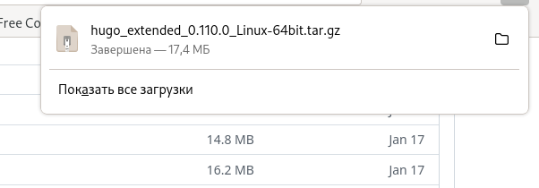
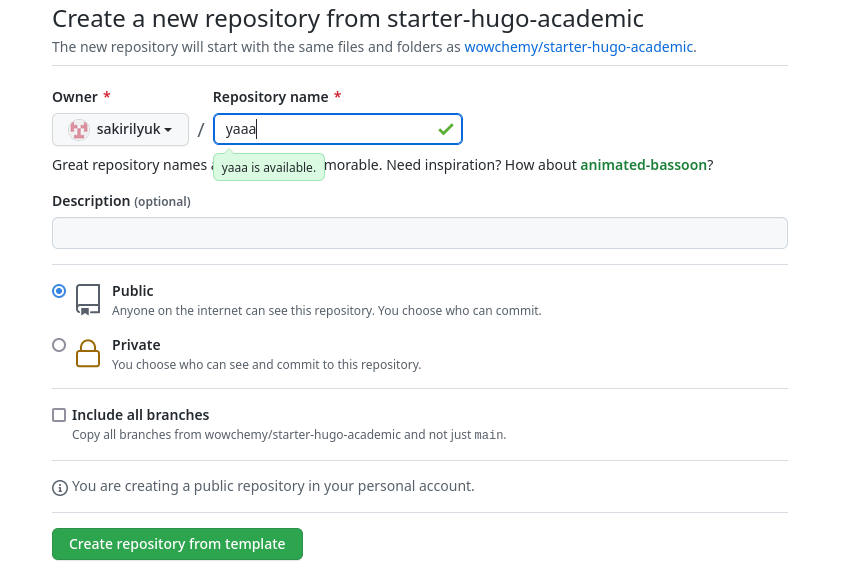
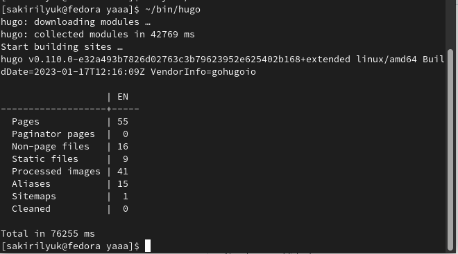
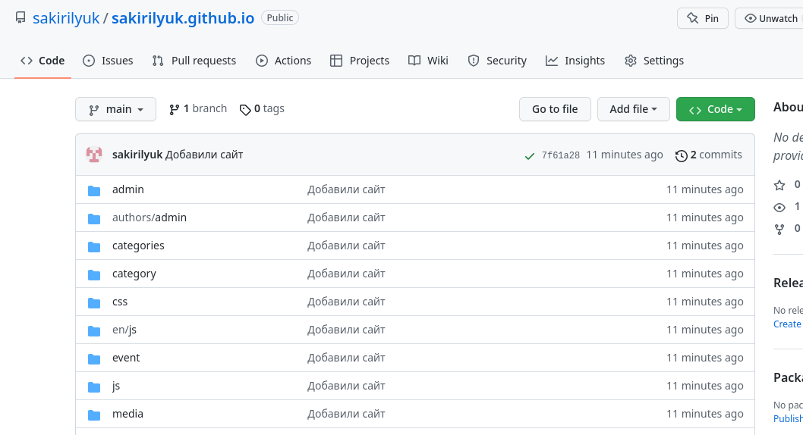
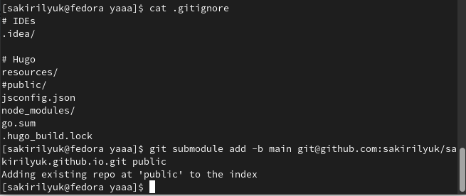

---
## Front matter
lang: ru-RU
title: 1-ый этап индивидального проекта
subtitle: Операционные системы 
author:
  - Кирилюк А. С.
institute:
  - Российский университет дружбы народов, Москва, Россия
  - Физико-математический факультет, НММбд-01-22
date: 23 февраля 2023

## i18n babel
babel-lang: russian
babel-otherlangs: english

## Formatting pdf
toc: false
toc-title: Содержание
slide_level: 2
aspectratio: 169
section-titles: true
theme: metropolis
header-includes:
 - \metroset{progressbar=frametitle,sectionpage=progressbar,numbering=fraction}
 - '\makeatletter'
 - '\beamer@ignorenonframefalse'
 - '\makeatother'
---

# Информация

## Докладчик

:::::::::::::: {.columns align=center}
::: {.column width="70%"}

  * Кирилюк Светлана Алексеевна
  * студент физико-математического факультета
  * направление математика и механика
  * Российский университет дружбы народов

:::
::: {.column width="30%"}

:::
::::::::::::::

# Вводная часть

## Цели

- Научиться создавать сайт на Hugo.
- Размещать сайт на GitHub.

## Задачи 
- Установить необходимое программное обеспечение.
- Скачать шаблон темы сайта.
- Разместить его на хостинге git.
- Установить параметр для URLs сайта.
- Разместить заготовку сайта на Github pages.

# Ход работы

## Установка программного обеспечения

В первую очередь я устанавливаю программное обеспечение для Hugo. Затем распаковываю скаченный файл и вырезаю из него единственный
исполняемый файл, вставляя его в ранее созданный каталог bin.

:::
::::::::::::::

## Создание репозитория №1

Далее я создаю новый репозиторий, даю ему произвольное название. Затем в терминале провожу команду клонирования.

:::
::::::::::::::

## Каталог "yaaa"

Перехожу в создавшийся каталог “yaaa” и ввожу команду “~/bin/hugo”. Из содержимого каталога удаляю каталог “public”, после чего выполняю команду “~/bin/hugo server”. Перехожу на страницу сайта, в терминале убираю синий фон сайта.

:::
::::::::::::::

## Создание репозитория №2

Теперь я создаю ещё одиин репозиторий со специальным именем “sakirilyuk.github.io” и снова выполняю клонирование. В каталоге с именем репозитория создаю ветку и файл, отправляю изменения на GitHub.

:::
::::::::::::::

## Каталог public

Я возвращаюсь в каталог “yaaa” и произвожу клонирование в “public”, после чего убираю игнорирование файла “public”, комментируя его. Затем я снова провожу клонирование. Снова выполняю команду “~/bin/hugo”, после чего в папке “public” появляются новые файлы. Затем проверяю связь папки и репозитория и отправляю изменения на Github.

:::
::::::::::::::

# Подведение итогов

## Вывод

В ходе выполнения 1-ого этапа индивидуального проекта я научилась создавать сайт на Hugo, размещать его на GitHub.

