---
## Front matter
title: "1-ый этап индивидуального проекта"
subtitle: "Операционные системы"
author: "Кирилюк Светлана Алексеевна"

## Generic otions
lang: ru-RU
toc-title: "Содержание"

## Bibliography
bibliography: bib/cite.bib
csl: pandoc/csl/gost-r-7-0-5-2008-numeric.csl

## Pdf output format
toc: true # Table of contents
toc-depth: 2
lof: true # List of figures
lot: true # List of tables
fontsize: 12pt
linestretch: 1.5
papersize: a4
documentclass: scrreprt
## I18n polyglossia
polyglossia-lang:
  name: russian
  options:
	- spelling=modern
	- babelshorthands=true
polyglossia-otherlangs:
  name: english
## I18n babel
babel-lang: russian
babel-otherlangs: english
## Fonts
mainfont: PT Serif
romanfont: PT Serif
sansfont: PT Sans
monofont: PT Mono
mainfontoptions: Ligatures=TeX
romanfontoptions: Ligatures=TeX
sansfontoptions: Ligatures=TeX,Scale=MatchLowercase
monofontoptions: Scale=MatchLowercase,Scale=0.9
## Biblatex
biblatex: true
biblio-style: "gost-numeric"
biblatexoptions:
  - parentracker=true
  - backend=biber
  - hyperref=auto
  - language=auto
  - autolang=other*
  - citestyle=gost-numeric
## Pandoc-crossref LaTeX customization
figureTitle: "Рис."
tableTitle: "Таблица"
listingTitle: "Листинг"
lofTitle: "Список иллюстраций"
lotTitle: "Список таблиц"
lolTitle: "Листинги"
## Misc options
indent: true
header-includes:
  - \usepackage{indentfirst}
  - \usepackage{float} # keep figures where there are in the text
  - \floatplacement{figure}{H} # keep figures where there are in the text
---

# Цель работы

Научиться создавать сайт на Hugo, размещать его на GitHub.

# Задание

1)Установить необходимое программное обеспечение.

2)Скачать шаблон темы сайта.

3)Разместить его на хостинге git.

4)Установить параметр для URLs сайта.

5)Разместить заготовку сайта на Github pages.

# Выполнение индивидуального проекта

В первую очередь я устанавливаю программное обеспечение для Hugo (рис. @fig:fig1). Затем распаковываю скаченный файл и вырезаю из него единственный исполняемый файл, вставляя его в ранее созданный каталог bin (рис. @fig:fig2). 

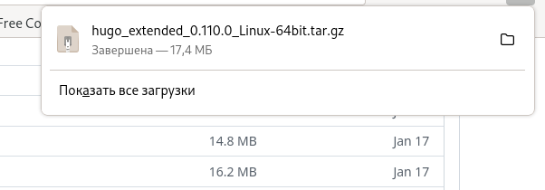{#fig:fig1 width=90%}

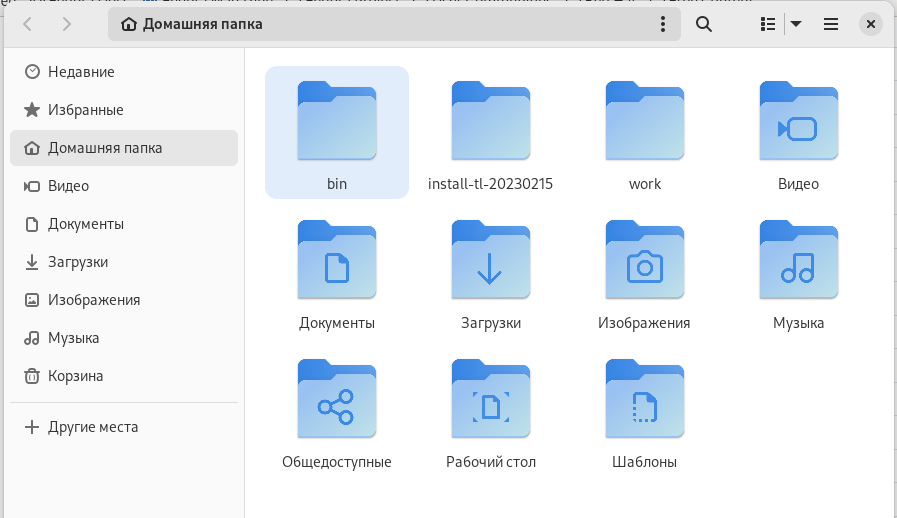{#fig:fig2 width=90%}

Далее я создаю новый репозиторий, даю ему произвольное название (рис. @fig:fig3). После создания репозитория я копирую его ссылку и вставляю её в терминал вместе с командой копирования (рис. @fig:fig4). 

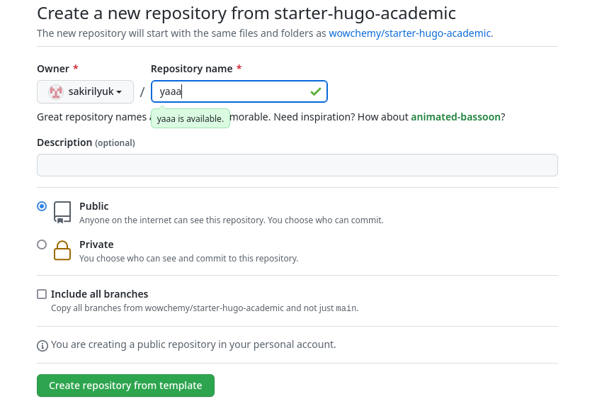{#fig:fig3 width=90%}

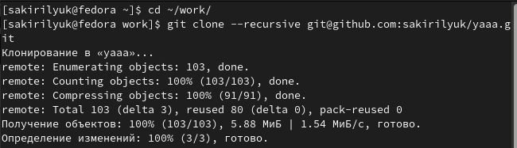{#fig:fig4 width=90%} 

Затем я перехожу в создавшийся каталог "yaaa" и ввожу команду "~/bin/hugo" (рис. @fig:fig5). Затем я просматриваю содержимое каталога и удаляю из него каталог "public" (рис. @fig:fig6), после чего снова выполняю команду "~/bin/hugo", добвляя на конце "server" (рис. @fig:fig7). После выполнения последней команды в терминале выводится ссылка на созданную страницу сайта. Чтобы убрать синий фон, я открываю файл "_index.md" папки "content" с помощью текстового редактора и удаляю полность перый блок файла (рис. @fig:fig8).

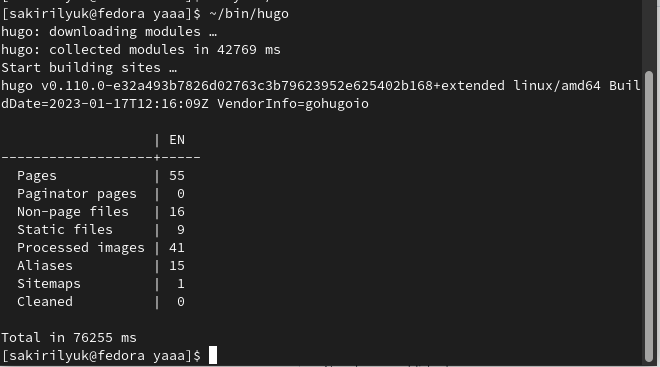{#fig:fig5 width=90%}

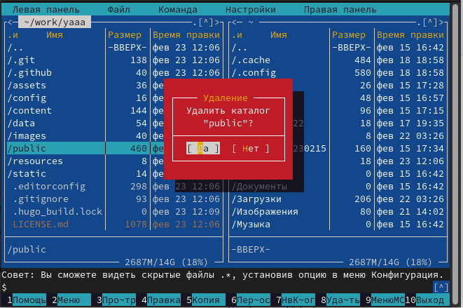{#fig:fig6 width=90%}

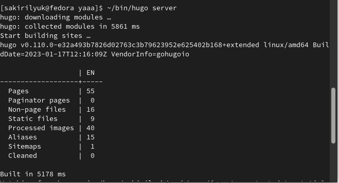{#fig:fig7 width=90%}

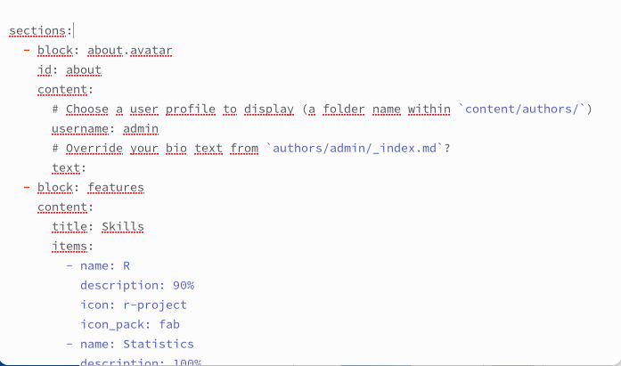{#fig:fig8 width=90%}

Теперь я создаю ещё одиин репозиторий со специальным именем "sakirilyuk.github.io" (рис. @fig:fig9) и снова выполняю клонирование (рис. @fig:fig10).

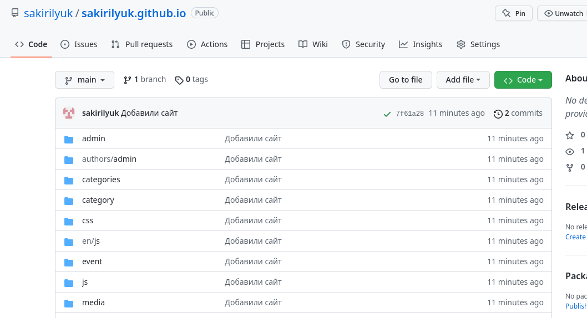{#fig:fig9 width=90%}

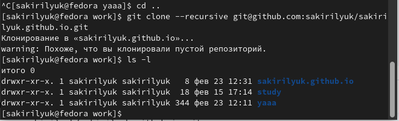{#fig:fig10 width=90%}

Затем я перехожу в созданный каталог, создаю новую ветку "main" и пустой файл "README.md" (рис. @fig:fig11), отправляю изменения на GitHub (рис. @fig:fig12).

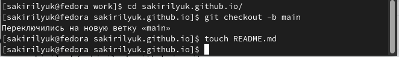{#fig:fig11 width=90%}

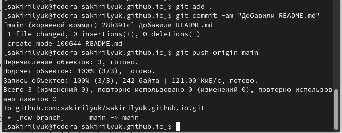{#fig:fig12 width=90%}

Я возвращаюсь в каталог "yaaa" и произвожу клонирование в "public" (рис. @fig:fig13), после чего убираю  игнорирование файла "public", комментируя его рис. @fig:fig14). Затем я снова провожу клонирование рис. @fig:fig15).

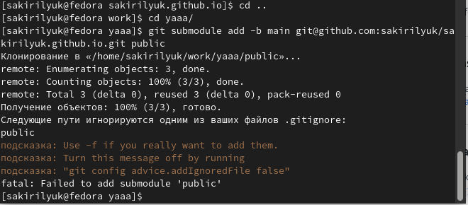{#fig:fig13 width=90%}

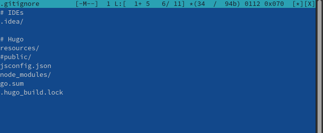{#fig:fig14 width=90%}

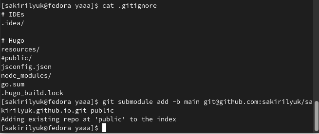{#fig:fig15 width=90%}

Снова выполняю команду "~/bin/hugo", после чего в папке "public" появляются новые файлы (рис. @fig:fig16). Затем проверяю связь папки и репозитория и отправляю изменения на Github (рис. @fig:fig17), (рис. @fig:fig18). Обновляю страницу репозитория, чтобы убедиться, что он обновился, и копирую конец ссылки на репозиторий, чтобы перейти на созданныый сайт.

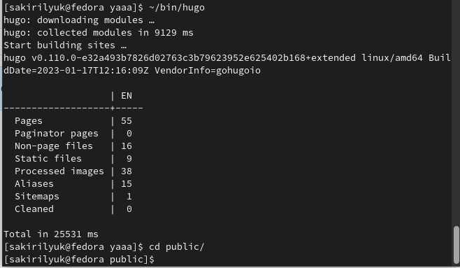{#fig:fig16 width=90%}

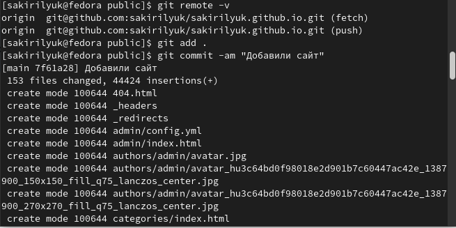{#fig:fig17 width=90%}

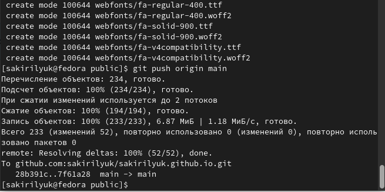{#fig:fig18 width=90%}

# Выводы

В ходе выполнения 1-ого этапа индивидуального проекта я научилась создавать сайт на Hugo, размещать его на GitHub.

