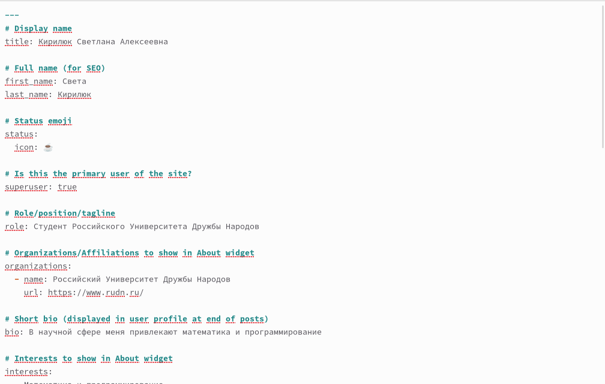
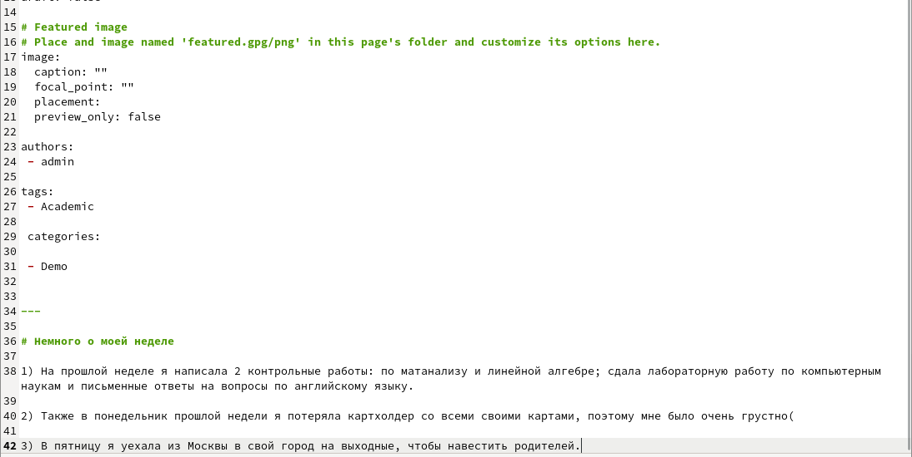
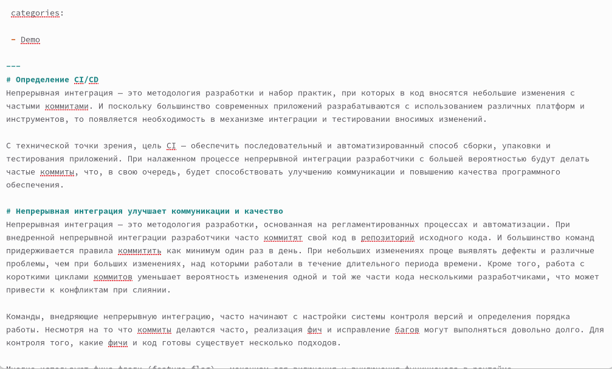
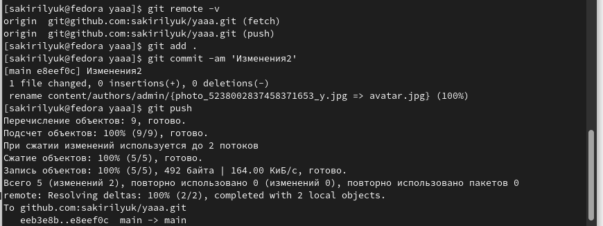

---
## Front matter
lang: ru-RU
title: 2-ой этап индивидуального проекта
subtitle: Операционные системы
author:
  - Кирилюк С. А.
institute:
  - Российский университет дружбы народов, Москва, Россия
  - Физико-математический факультет
date: 18 марта 2023

## i18n babel
babel-lang: russian
babel-otherlangs: english

## Formatting pdf
toc: false
toc-title: Содержание
slide_level: 2
aspectratio: 169
section-titles: true
theme: metropolis
header-includes:
 - \metroset{progressbar=frametitle,sectionpage=progressbar,numbering=fraction}
 - '\makeatletter'
 - '\beamer@ignorenonframefalse'
 - '\makeatother'
---

# Информация

## Докладчик

:::::::::::::: {.columns align=center}
::: {.column width="70%"}

  * Кирилюк Светлана Алексеевна
  * студент физико-математического факультета 
  * направление математика и механика 
  * Российский университет дружбы народов

:::
::: {.column width="30%"}

:::
::::::::::::::

# Вводная часть

## Задачи

Добавить к сайту данные о себе.
1) Список добавляемых данных.
• Разместить фотографию владельца сайта.
• Разместить краткое описание владельца сайта (Biography).
• Добавить информацию об интересах (Interests).
• Добавить информацию от образовании (Education).
2) Сделать пост по прошедшей неделе.
3) Добавить пост на тему по выбору:
• Управление версиями. Git.
• Непрерывная интеграция и непрерывное развертывание (CI/CD).

# Процесс выполнения 2-ого этапа

## Информация о владельце страницы

Я добавила в подкаталог admin каталога yaaa информацию о себе, свои интересы и образование, прикрепила фотографию.

:::
::::::::::::::

## Пост о прошедшей неделе

Затем я создала пост о прошедшей неделе при помощи команды, после чего заполнила информацию в открывшемся файле.

:::
::::::::::::::

## Пост непрерывной интеграции и непрерывном развертывании (CI/CD)

Я повторила команду в терминале, чтобы создать пост о непрерывной интеграции и непрерывном развертывании (CI/CD), затем вновь заполнила открывшийся файл.

:::
::::::::::::::

## Проверка сайта

Я ввела команду, чтобы проверить, как выглядит сайт, после чего перешла по появившейся ссылке на сайт.

:::
::::::::::::::

## Отправка изменений каталогов

Завершив выполнение этапа проекта, я сначала отпраила изменения каталога yaaa на GitHub, тоже самое я сделала с каталогом public.

:::
::::::::::::::

# Результаты

## Выводы

В ходе работы я научилась прикреплять информацию на сайт, публиковать посты.
