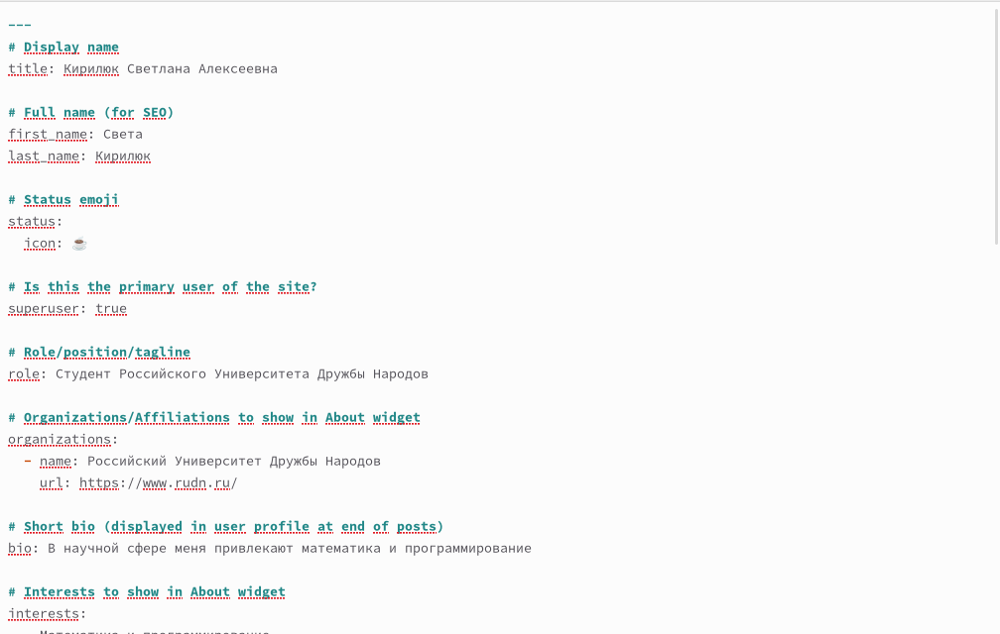
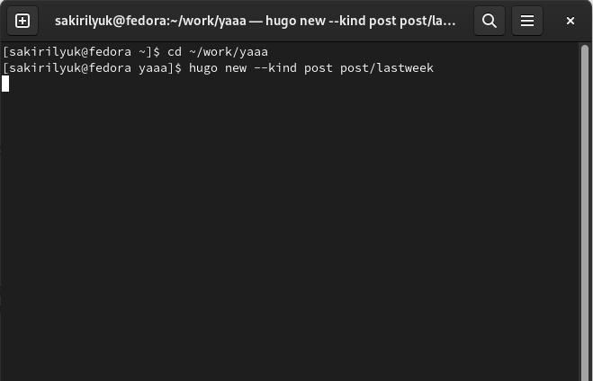
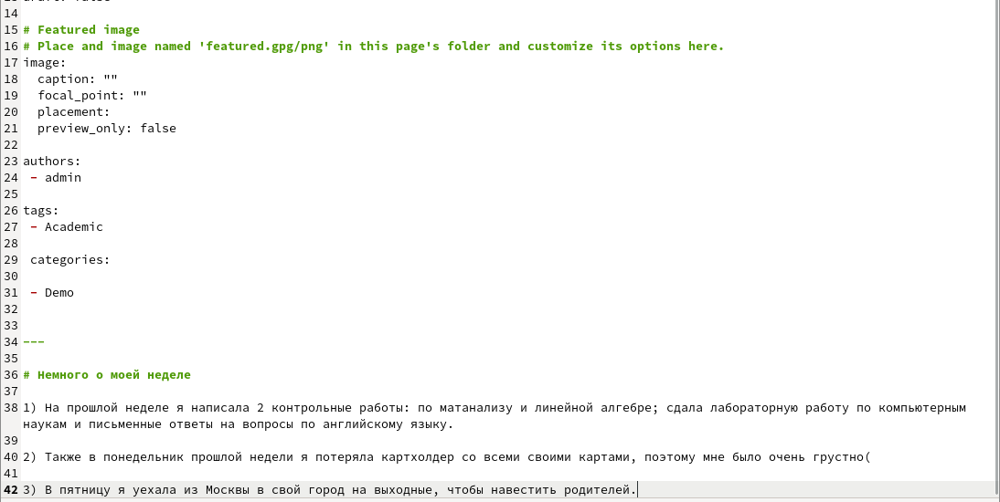
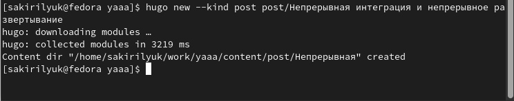
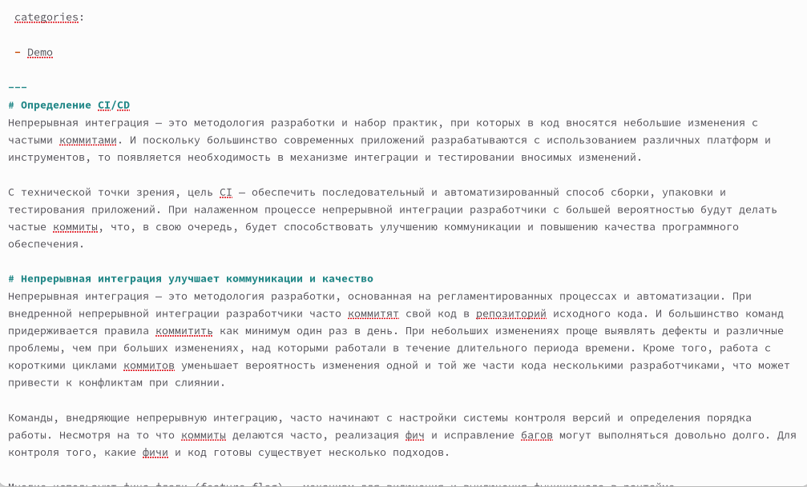
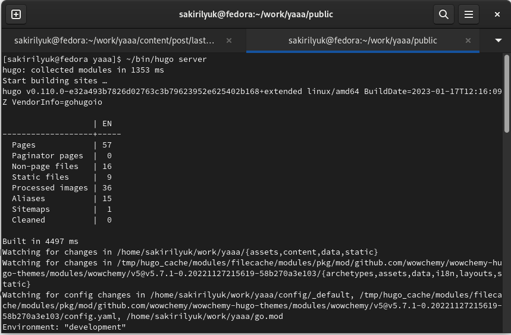
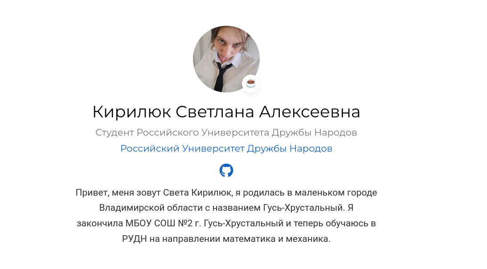
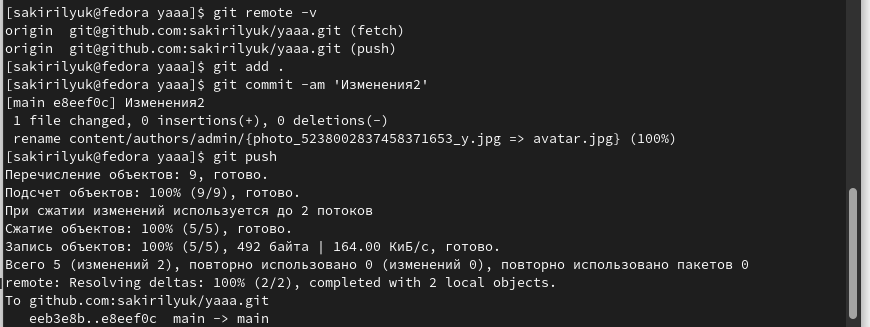
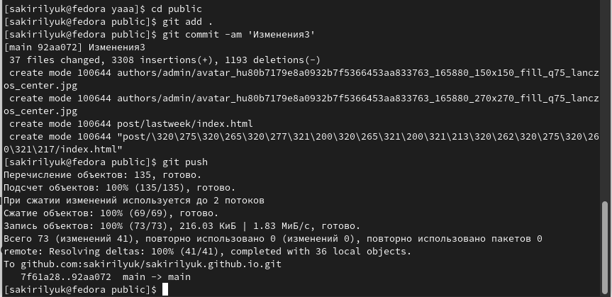

---
## Front matter
title: "2-й этап индивидуального проекта"
subtitle: "Операционные системы"
author: "Кирилюк Светалана Алексеевна"

## Generic otions
lang: ru-RU
toc-title: "Содержание"

## Bibliography
bibliography: bib/cite.bib
csl: pandoc/csl/gost-r-7-0-5-2008-numeric.csl

## Pdf output format
toc: true # Table of contents
toc-depth: 2
lof: true # List of figures
lot: true # List of tables
fontsize: 12pt
linestretch: 1.5
papersize: a4
documentclass: scrreprt
## I18n polyglossia
polyglossia-lang:
  name: russian
  options:
	- spelling=modern
	- babelshorthands=true
polyglossia-otherlangs:
  name: english
## I18n babel
babel-lang: russian
babel-otherlangs: english
## Fonts
mainfont: PT Serif
romanfont: PT Serif
sansfont: PT Sans
monofont: PT Mono
mainfontoptions: Ligatures=TeX
romanfontoptions: Ligatures=TeX
sansfontoptions: Ligatures=TeX,Scale=MatchLowercase
monofontoptions: Scale=MatchLowercase,Scale=0.9
## Biblatex
biblatex: true
biblio-style: "gost-numeric"
biblatexoptions:
  - parentracker=true
  - backend=biber
  - hyperref=auto
  - language=auto
  - autolang=other*
  - citestyle=gost-numeric
## Pandoc-crossref LaTeX customization
figureTitle: "Рис."
tableTitle: "Таблица"
listingTitle: "Листинг"
lofTitle: "Список иллюстраций"
lotTitle: "Список таблиц"
lolTitle: "Листинги"
## Misc options
indent: true
header-includes:
  - \usepackage{indentfirst}
  - \usepackage{float} # keep figures where there are in the text
  - \floatplacement{figure}{H} # keep figures where there are in the text
---

# Задание

Добавить к сайту данные о себе.

1) Список добавляемых данных.
- Разместить фотографию владельца сайта.
- Разместить краткое описание владельца сайта (Biography).
- Добавить информацию об интересах (Interests).
- Добавить информацию от образовании (Education).
2) Сделать пост по прошедшей неделе.
3) Добавить пост на тему по выбору:
- Управление версиями. Git.
- Непрерывная интеграция и непрерывное развертывание (CI/CD).

# Выполнение этапа проекта

1) Я добавила в подкаталог admin каталога yaaa информацию о себе, свои интересы и образование, прикрепила фотографи (рис. @fig:fig1).

{#fig:fig1 width=90%}

2) Затем я создала пост о прошедшей неделе при помощи команды (рис. @fig:fig2), после чего заполнила информацию в открывшемся файле (рис. @fig:fig3). 

{#fig:fig2 width=90%}

{#fig:fig3 width=90%}

3) Я повторила команду в терминале, чтобы создать пост о непрерывной интеграции и непрерывном развертывании (CI/CD) (рис. @fig:fig4), затем вновь заполнила открывшийся файл (рис. @fig:fig5).

{#fig:fig4 width=90%}

{#fig:fig5 width=90%}

4) Я ввела команду, чтобы проверить, как выглядит сайт (рис. @fig:fig6), после чего перешла по появившейся ссылке на сайт (рис. @fig:fig7).

{#fig:fig6 width=90%}

{#fig:fig7 width=90%}

5) Завершив выполнение этапа проекта, я сначала отпраила изменения каталога yaaa на GitHub (рис. @fig:fig8), тоже самое я сделала с каталогом public (рис. @fig:fig9).

{#fig:fig8 width=90%}

{#fig:fig9 width=90%}

# Выводы

В ходе работы я научилась прикреплять информацию на сайт, публиковать посты.
