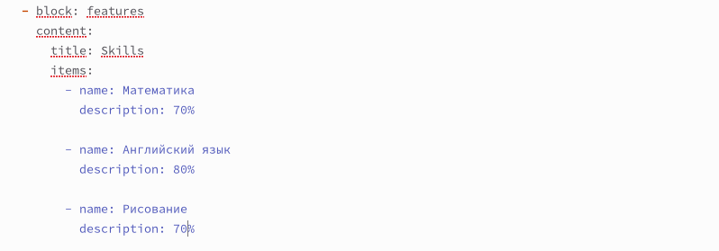
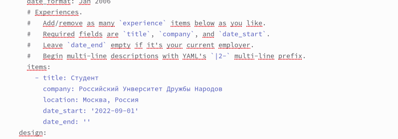
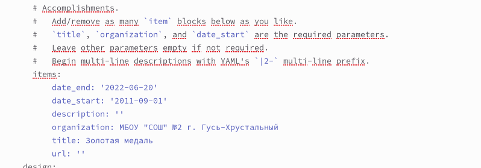
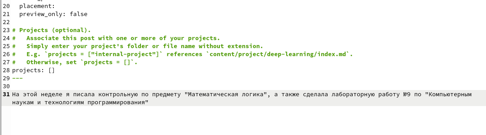
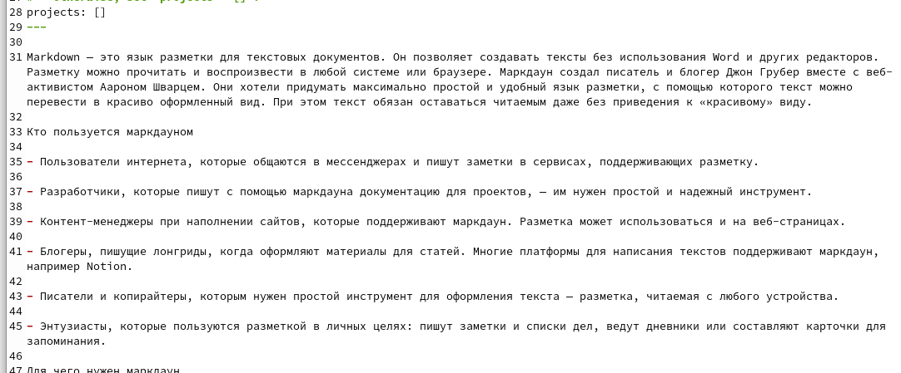

---
## Front matter
lang: ru-RU
title: Индивидуальный проект, этап 3
subtitle: Операционные системы
author:
  - Кирилюк С. А.
institute:
  - Российский университет дружбы народов, Москва, Россия
  - Физико-математический факультет
date: 08 апреля 2023

## i18n babel
babel-lang: russian
babel-otherlangs: english

## Formatting pdf
toc: false
toc-title: Содержание
slide_level: 2
aspectratio: 169
section-titles: true
theme: metropolis
header-includes:
 - \metroset{progressbar=frametitle,sectionpage=progressbar,numbering=fraction}
 - '\makeatletter'
 - '\beamer@ignorenonframefalse'
 - '\makeatother'
---

# Информация

## Докладчик

:::::::::::::: {.columns align=center}
::: {.column width="70%"}

  * Кирилюк Светлана Алексеевна
  * Студент физико-математического факультета
  * Направление математика и механика
  * Российский университет дружбы народов

:::
::: {.column width="30%"}

:::
::::::::::::::

# Ход работы

## Задачи

Добавить к сайту достижения: информация о навыках (Skills), информация об опыте (Experience), информация о достижениях (Accomplishments). Сделать пост по прошедшей неделе. Добавить пост на тему по теме “Язык разметки Markdown”.

## Навыки

Открыв в каталоге content текстовый файл _index.md, я добавила информацию о навыках.

:::
::::::::::::::

## Опыт

Добавила информацию об опыте.

:::
::::::::::::::

## Достиженияя

Я добавила информацию о достижениях

:::
::::::::::::::

## Пост о прошедшей неделе

Введя команду для создания поста, я создала пост о прошедшей неделе.

:::
::::::::::::::

## Язык разметки Markdown

При помощи ещё одной команды создала пост по теме “Язык разметки Markdown”.

:::
::::::::::::::

# Результаты

## Выводы

В ходе выполнения работы я добавила к сайту информацию о достижениях, создала пост о прошедшей неделе и пост “Язык разметки Markdown”.

