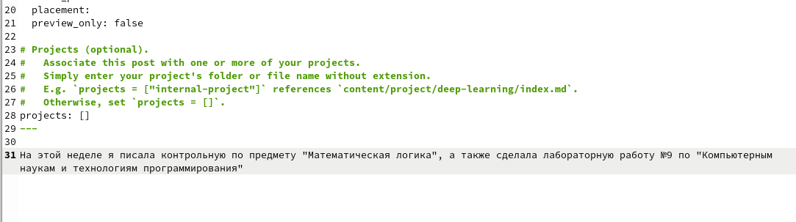

---
## Front matter
title: "Индивидуальный проект, этап №3"
subtitle: "Операционные системы"
author: "Кирилюк Светлана Алексеевна"

## Generic otions
lang: ru-RU
toc-title: "Содержание"

## Bibliography
bibliography: bib/cite.bib
csl: pandoc/csl/gost-r-7-0-5-2008-numeric.csl

## Pdf output format
toc: true # Table of contents
toc-depth: 2
lof: true # List of figures
lot: true # List of tables
fontsize: 12pt
linestretch: 1.5
papersize: a4
documentclass: scrreprt
## I18n polyglossia
polyglossia-lang:
  name: russian
  options:
	- spelling=modern
	- babelshorthands=true
polyglossia-otherlangs:
  name: english
## I18n babel
babel-lang: russian
babel-otherlangs: english
## Fonts
mainfont: PT Serif
romanfont: PT Serif
sansfont: PT Sans
monofont: PT Mono
mainfontoptions: Ligatures=TeX
romanfontoptions: Ligatures=TeX
sansfontoptions: Ligatures=TeX,Scale=MatchLowercase
monofontoptions: Scale=MatchLowercase,Scale=0.9
## Biblatex
biblatex: true
biblio-style: "gost-numeric"
biblatexoptions:
  - parentracker=true
  - backend=biber
  - hyperref=auto
  - language=auto
  - autolang=other*
  - citestyle=gost-numeric
## Pandoc-crossref LaTeX customization
figureTitle: "Рис."
tableTitle: "Таблица"
listingTitle: "Листинг"
lofTitle: "Список иллюстраций"
lotTitle: "Список таблиц"
lolTitle: "Листинги"
## Misc options
indent: true
header-includes:
  - \usepackage{indentfirst}
  - \usepackage{float} # keep figures where there are in the text
  - \floatplacement{figure}{H} # keep figures where there are in the text
---

# Задание

Добавить к сайту достижения: информация о навыках (Skills), информация об опыте (Experience), информация о достижениях (Accomplishments). Сделать пост по прошедшей неделе.
Добавить пост на тему по теме "Язык разметки Markdown".

# Ход работы

Открыв в каталоге content текстовый файл _index.md, я добавила информацию о навыках (рис. @fig:fi1), информацию об опыте (рис. @fig:fi2), и достижения (рис. @fig:fi3).

{#fig:fig1 width=70%}

{#fig:fig2 width=70%}

{#fig:fig3 width=70%}

Введякоманду для создания поста, я создала пост о прошедшей неделе (рис. @fig:fi4).

{#fig:fig4 width=70%}

При помощи ещё одной команды создала пост по теме "Язык разметки Markdown" (рис. @fig:fi5).

{#fig:fig5 width=70%}

# Выводы

В ходе выполнения работы я добавила к сайту информацию о достижениях, создала пост о прошедшей неделе и пост "Язык разметки Markdown".
