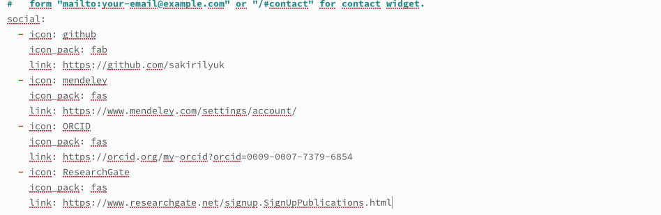
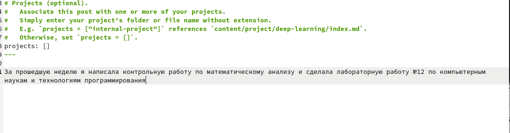
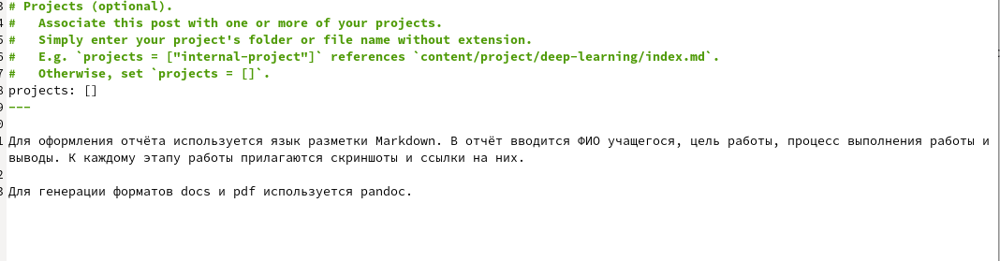

---
## Front matter
lang: ru-RU
title: Индивидуальный проект 4 этап
subtitle: Операционные системы 
author:
  - Кирилюк С. А.
institute:
  - Российский университет дружбы народов, Москва, Россия
  - Физико-математический факультет
date: 29 апреля 2023

## i18n babel
babel-lang: russian
babel-otherlangs: english

## Formatting pdf
toc: false
toc-title: Содержание
slide_level: 2
aspectratio: 169
section-titles: true
theme: metropolis
header-includes:
 - \metroset{progressbar=frametitle,sectionpage=progressbar,numbering=fraction}
 - '\makeatletter'
 - '\beamer@ignorenonframefalse'
 - '\makeatother'
---

# Информация

## Докладчик

:::::::::::::: {.columns align=center}
::: {.column width="70%"}

  * Кирилюк Светлана Алексеевна
  * студент физико-математического факультета
  * Направление математика и механика
  * Российский университет дружбы народов

:::
::: {.column width="30%"}

:::
::::::::::::::

# Вводная часть

## Цели и задачи

1)Зарегистрироваться на соответствующих ресурсах и разместить на них ссыл-
ки на сайте.
2)Сделать пост по прошедшей неделе.
3)Добавить пост на тему по выбору.

# Ход работы

## Добавление ссылок на сайты

Зарегестривовавшись на указанных сайтах, я добавила ссылки на них на сайте.

:::
::::::::::::::

## Пост по прошедшей неделе

Затем в терминале я создала новый пост по прошедшей неделе и добавила его на сайт.

:::
::::::::::::::

## Пост по подготовке отчёта

После чего так же создала пост по подготовке отчёта и добавила на сайт.

:::
::::::::::::::

# Результаты

## Выводы

В ходе работы я смогла добавить ссылки на сои аккаунты на разных сайтах, новый пост по прошедшей неделе и пост по созданию отчёта.
