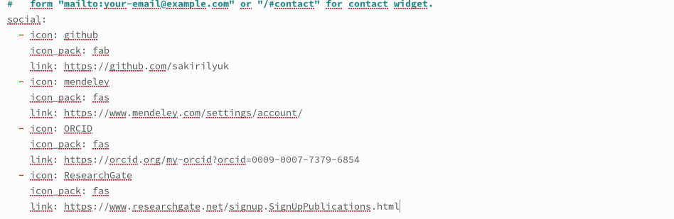
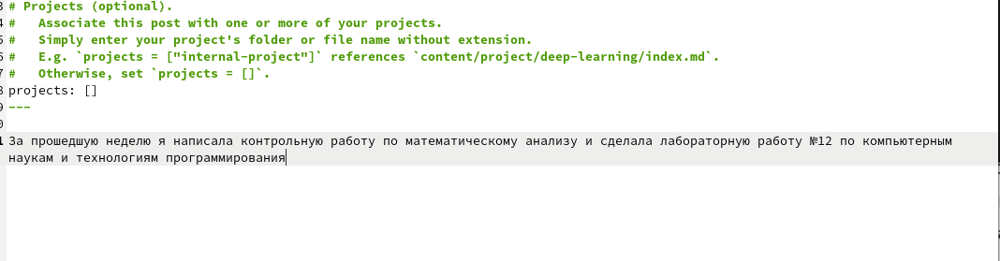
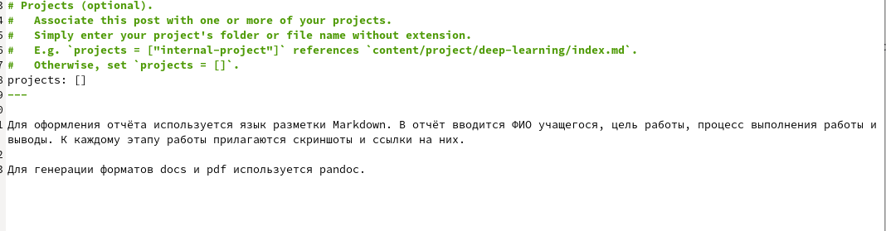

---
## Front matter
title: "Индивидуальный проект этап 4"
subtitle: "Операционные системы"
author: "Кирилюк Светлана Алексеевна"

## Generic otions
lang: ru-RU
toc-title: "Содержание"

## Bibliography
bibliography: bib/cite.bib
csl: pandoc/csl/gost-r-7-0-5-2008-numeric.csl

## Pdf output format
toc: true # Table of contents
toc-depth: 2
lof: true # List of figures
lot: true # List of tables
fontsize: 12pt
linestretch: 1.5
papersize: a4
documentclass: scrreprt
## I18n polyglossia
polyglossia-lang:
  name: russian
  options:
	- spelling=modern
	- babelshorthands=true
polyglossia-otherlangs:
  name: english
## I18n babel
babel-lang: russian
babel-otherlangs: english
## Fonts
mainfont: PT Serif
romanfont: PT Serif
sansfont: PT Sans
monofont: PT Mono
mainfontoptions: Ligatures=TeX
romanfontoptions: Ligatures=TeX
sansfontoptions: Ligatures=TeX,Scale=MatchLowercase
monofontoptions: Scale=MatchLowercase,Scale=0.9
## Biblatex
biblatex: true
biblio-style: "gost-numeric"
biblatexoptions:
  - parentracker=true
  - backend=biber
  - hyperref=auto
  - language=auto
  - autolang=other*
  - citestyle=gost-numeric
## Pandoc-crossref LaTeX customization
figureTitle: "Рис."
tableTitle: "Таблица"
listingTitle: "Листинг"
lofTitle: "Список иллюстраций"
lotTitle: "Список таблиц"
lolTitle: "Листинги"
## Misc options
indent: true
header-includes:
  - \usepackage{indentfirst}
  - \usepackage{float} # keep figures where there are in the text
  - \floatplacement{figure}{H} # keep figures where there are in the text
---

# Задание

1)Зарегистрироваться на соответствующих ресурсах и разместить на них ссылки на сайте:
eLibrary : https://elibrary.ru/;
Google Scholar : https://scholar.google.com/;
ORCID : https://orcid.org/;
Mendeley : https://www.mendeley.com/;
ResearchGate : https://www.researchgate.net/;
Academia.edu : https://www.academia.edu/;
arXiv : https://arxiv.org/;
github : https://github.com/.

2)Сделать пост по прошедшей неделе.

3)Добавить пост на тему по выбору:
Оформление отчёта.
Создание презентаций.
Работа с библиографией.

# Выполнение этапа 4

Зарегестривовавшись на указанных сайтах, я добавила ссылки на них на сайте (рис. @fig:fig1).

{#fig:fig1 width=70%}

Затем в терминале я создала новый пост по прошедшей неделе и добавила его на сайт  (рис. @fig:fig2).

{#fig:fig2 width=70%}

После чего так же создала пост по подготовке отчёта и добавила на сайт  (рис. @fig:fig3).

{#fig:fig3 width=70%}

Затем в терминале ввела команду hugo и перейдя сначала в каталог ~/work/yaaa а затем ~/work/yaaa/public закинула изменения на репозиторий, чтобы они сохранились на сайте.

# Выводы

В ходе работы я смогла добавить ссылки на сои аккаунты на разных сайтах, новый пост по прошедшей неделе и пост по созданию отчёта.
