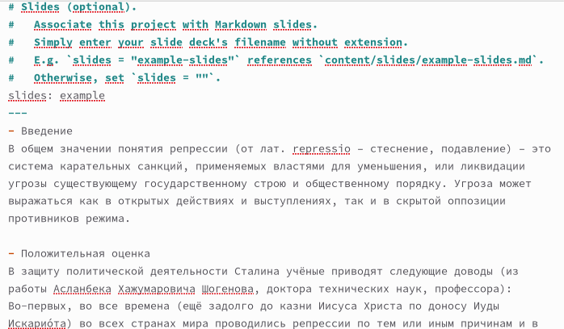
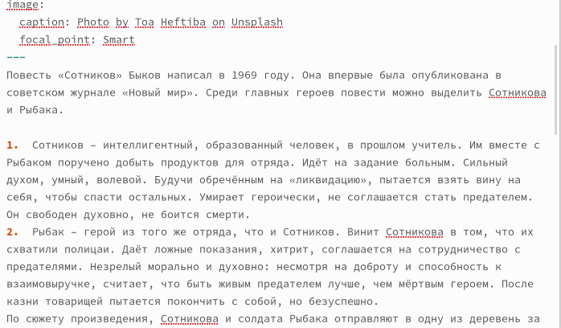
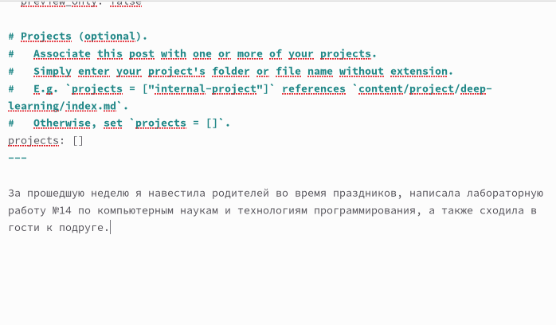
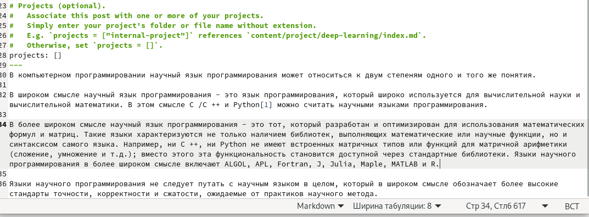

---
## Front matter
lang: ru-RU
title: Индивидуальный проект этап №5
subtitle: Операционные системы
author:
  - Кирилюк С. А.
institute:
  - Российский университет дружбы народов, Москва, Россия
  - Физико-математический факультет
date: 13 мая 2023

## i18n babel
babel-lang: russian
babel-otherlangs: english

## Formatting pdf
toc: false
toc-title: Содержание
slide_level: 2
aspectratio: 169
section-titles: true
theme: metropolis
header-includes:
 - \metroset{progressbar=frametitle,sectionpage=progressbar,numbering=fraction}
 - '\makeatletter'
 - '\beamer@ignorenonframefalse'
 - '\makeatother'
---

# Информация

## Докладчик

:::::::::::::: {.columns align=center}
::: {.column width="70%"}

  * Кирилюк Светлана Алексеевна
  * Студент физико-математического факультета
  * Направление математика и механика
  * Российский университет дружбы народов

:::
::: {.column width="30%"}

:::
::::::::::::::

# Вводная часть

## Цели и задачи

Сделать записи для персональных проектов, пост по прошедшей неделе, добавить пост на тему языки научного программирования.

# Ход работы

## Прикрепление к сайту первого проекта

Перейдя в каталог ~/work/yaaa/content/project, я добавила первый доклад и прикрепила фотографию к нему в первом каталоге.

:::
::::::::::::::

## Прикрепление к сайту второго проекта

Аналогично прикрепила к сайту второй доклад с фвотографией.

:::
::::::::::::::

## Пост по прошедшей неделе

Затем, введя команду “hugo new –kind post post/lastweek4”, я создала каталог для поста. После чего я открыла файл, принадлежащий каталогу, при помощи текстового редактора и вставила информацию для поста по прошедшей неделе.

:::
::::::::::::::

## Пост по языкам научного программирования

Повторив команду, я создала каталог “Языки” и и в нём открыла файл для редактирования поста на тему языков научного программирования.

:::
::::::::::::::

# Результаты

## Выводы

В ходе работы я сделала записи для персональных проектов, пост по прошедшей неделе, добавила пост на тему языки научного программирования.
