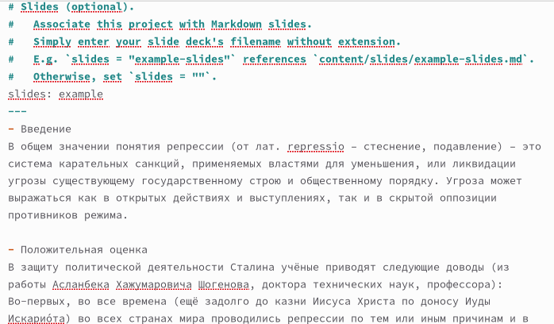
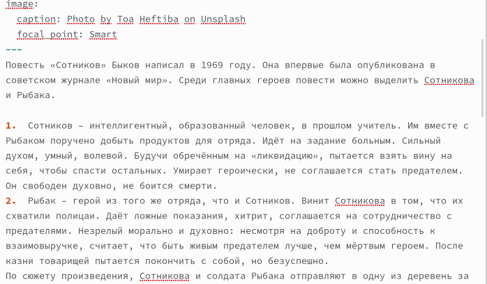
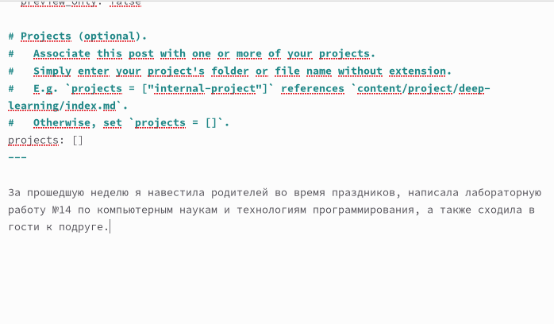
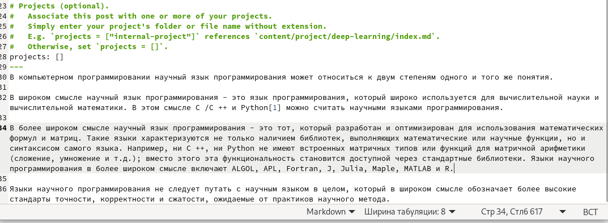

---
## Front matter
title: "Индивидуальный проект этап №5"
subtitle: "Операционные системы"
author: "Кирилюк Светлана Алексеевна"

## Generic otions
lang: ru-RU
toc-title: "Содержание"

## Bibliography
bibliography: bib/cite.bib
csl: pandoc/csl/gost-r-7-0-5-2008-numeric.csl

## Pdf output format
toc: true # Table of contents
toc-depth: 2
lof: true # List of figures
lot: true # List of tables
fontsize: 12pt
linestretch: 1.5
papersize: a4
documentclass: scrreprt
## I18n polyglossia
polyglossia-lang:
  name: russian
  options:
	- spelling=modern
	- babelshorthands=true
polyglossia-otherlangs:
  name: english
## I18n babel
babel-lang: russian
babel-otherlangs: english
## Fonts
mainfont: PT Serif
romanfont: PT Serif
sansfont: PT Sans
monofont: PT Mono
mainfontoptions: Ligatures=TeX
romanfontoptions: Ligatures=TeX
sansfontoptions: Ligatures=TeX,Scale=MatchLowercase
monofontoptions: Scale=MatchLowercase,Scale=0.9
## Biblatex
biblatex: true
biblio-style: "gost-numeric"
biblatexoptions:
  - parentracker=true
  - backend=biber
  - hyperref=auto
  - language=auto
  - autolang=other*
  - citestyle=gost-numeric
## Pandoc-crossref LaTeX customization
figureTitle: "Рис."
tableTitle: "Таблица"
listingTitle: "Листинг"
lofTitle: "Список иллюстраций"
lotTitle: "Список таблиц"
lolTitle: "Листинги"
## Misc options
indent: true
header-includes:
  - \usepackage{indentfirst}
  - \usepackage{float} # keep figures where there are in the text
  - \floatplacement{figure}{H} # keep figures where there are in the text
---

# Задание

Сделать записи для персональных проектов, пост по прошедшей неделе, добавить пост на тему языки научного программирования.

# Ход работы

Перейдя в каталог ~/work/yaaa/content/project, я добавила первый доклад и прикрепила фотографию к нему в первом каталоге (рис. @fig:fig1).

{#fig:fig1 width=70%}

Аналогично прикрепила к сайту второй доклад с фвотографией (рис. @fig:fig2).

{#fig:fig2 width=70%}

Затем, введя команду "hugo new --kind post post/lastweek4", я создала каталог для поста. После чего я открыла файл, принадлежащий каталогу, при помощи текстового редактора и вставила информацию для поста по прошедшей неделе (рис. @fig:fig3). 

{#fig:fig3 width=70%}

Повторив команду, я создала каталог "Языки" и и в нём открыла файл для редактирования поста на тему языков научного программирования (рис. @fig:fig4).

{#fig:fig4 width=70%}

Введя в терминале команду hugo server, я проверила, что изменения, отобразившиеся на сайте, были корректными. После чего, находясь в каталоге yaaa, я ввела команду hugo и отправила изменения в этом каталоге на репозиторий. Затем перешла в подкаталог public и так же отправила изменения на репозиторий.

# Выводы

В ходе работы я сделала записи для персональных проектов, пост по прошедшей неделе, добавила пост на тему языки научного программирования.

